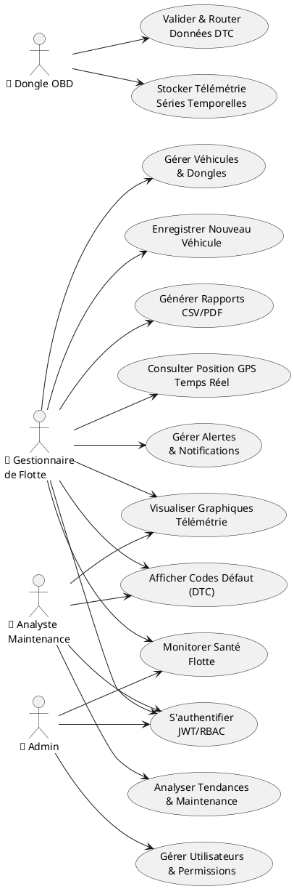
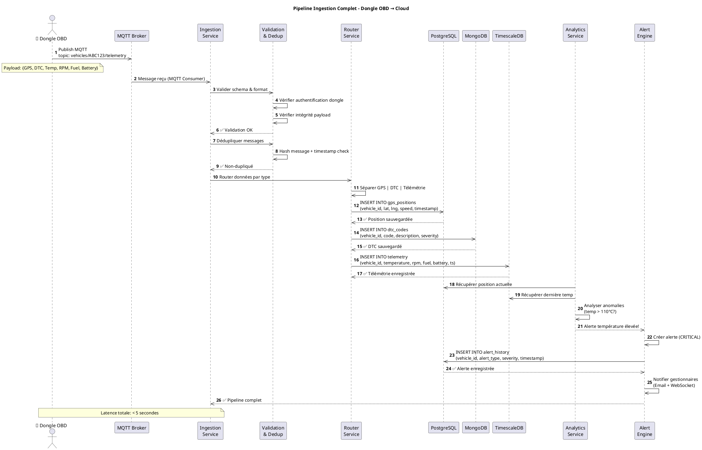
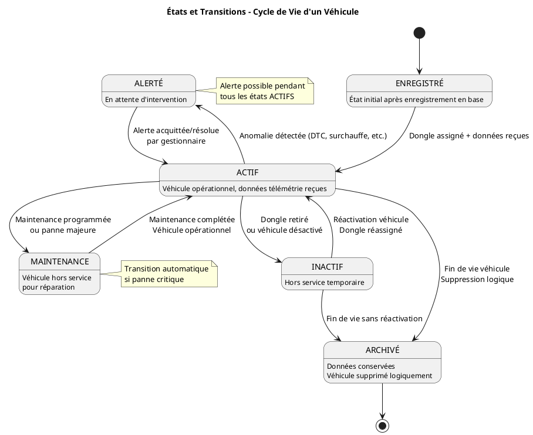
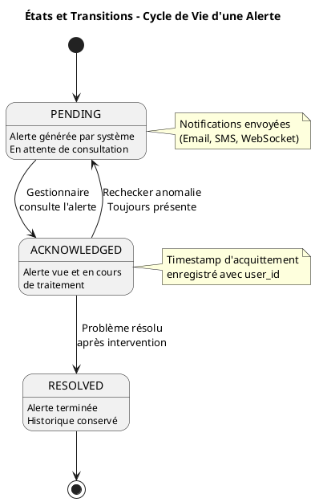
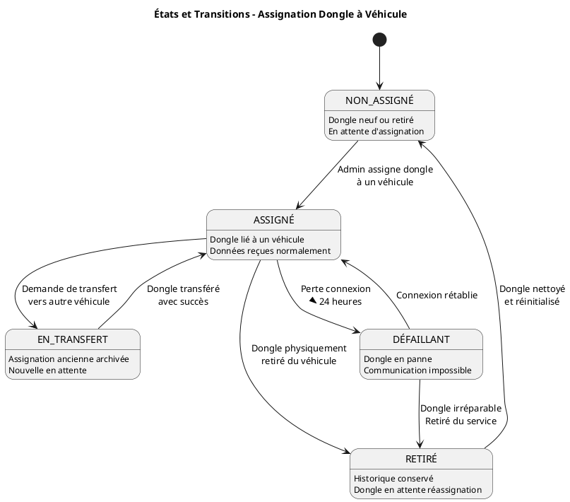

# Conception  – MALLOULIAUTO

**Auteur** :imen mallouli 
**Date** : 4 février 2026  
**Projet** : Plateforme Cloud IoT de Diagnostic Automobile  
**Phase** : Conception Architecture Backend

---

## Définition du Projet

Ce projet consiste à concevoir et développer **l'infrastructure backend et cloud complète** d'une plateforme IoT de gestion de flotte automobile intelligente nommée **MALLOULIAUTO**. La solution vise à collecter, stocker, traiter et servir en temps réel les données télémétriques issues de dongles OBD (On-Board Diagnostics) installés sur les véhicules d'une flotte, afin de fournir aux gestionnaires une visibilité complète sur l'état de leurs véhicules et de permettre une maintenance prédictive.

Le cœur du système repose sur une **architecture cloud microservices scalable et résiliente** capable de gérer des milliers de véhicules connectés simultanément. Les données collectées incluent les codes défaut (DTC), la géolocalisation GPS, ainsi que la télémétrie détaillée (vitesse, régime moteur, température, batterie, consommation carburant). Ces informations sont ingérées via des protocoles IoT légers (MQTT, HTTP, WebSocket), validées, puis routées intelligemment vers un système de stockage hybride optimisé pour différents types de données.

La dimension **diagnostic automobile** est au cœur de la plateforme. Le système analyse en temps réel les **codes défaut DTC** (Diagnostic Trouble Codes) transmis par les dongles OBD pour identifier les pannes et anomalies mécaniques : moteur, transmission, freins, capteurs, système électrique. Chaque code DTC est décodé, enrichi avec sa description technique, sa gravité (critique, avertissement, information), et associé à des recommandations d'actions correctives. Le backend stocke l'historique complet des diagnostics pour chaque véhicule, permettant le suivi longitudinal des défaillances, la détection de pannes récurrentes, et la corrélation entre anomalies et comportement du véhicule (par exemple, surchauffe moteur liée à une conduite agressive détectée via télémétrie). Les alertes de diagnostic sont hiérarchisées par urgence et envoyées en temps réel aux gestionnaires de flotte via le dashboard web et aux chauffeurs via notifications, permettant une **intervention rapide avant aggravation** et réduisant les coûts de maintenance imprévue.

L'**exploitation visuelle des données de diagnostic et télémétrie** constitue un élément central du dashboard web. Le backend transforme les données brutes stockées (DTC, GPS, télémétrie) en **visualisations interactives et intelligibles** pour faciliter la prise de décision. Les gestionnaires de flotte accèdent à des **courbes temporelles** montrant l'évolution des paramètres critiques : température moteur sur les 7 derniers jours, consommation carburant par trajet, variation de la pression des pneus, niveau de batterie. Les **graphiques d'analyse** permettent d'identifier les tendances anormales (pics de température récurrents, surconsommation carburant, dégradation progressive) et de détecter les signes avant-coureurs de pannes. Le système génère également des **tableaux de bord synthétiques** affichant les indicateurs clés de performance (KPI) : nombre de codes DTC actifs par véhicule, fréquence des alertes critiques, taux de disponibilité de la flotte, coûts de maintenance estimés. Les données géographiques sont projetées sur des **cartes interactives** (Leaflet/OpenStreetMap) montrant la position temps réel de chaque véhicule avec code couleur selon leur état de santé (vert : sain, orange : avertissement, rouge : critique). Les **histogrammes et diagrammes circulaires** permettent de comparer les performances entre véhicules, d'identifier les véhicules les plus problématiques, et de visualiser la répartition des types de pannes. Toutes ces visualisations sont actualisées automatiquement via WebSocket pour refléter l'état en temps réel de la flotte, avec possibilité d'export en PDF ou CSV pour les rapports périodiques.

Mon projet couvre quatre composantes techniques majeures :

1. **Conception de l'architecture cloud microservices** : Définition de l'architecture globale, sélection des technologies cloud (AWS ou Azure), orchestration avec Docker et Kubernetes, mise en place de l'infrastructure as code (Terraform).

2. **Développement du backend et des API** : Création d'une API RESTful sécurisée utilisant Python (FastAPI) pour la communication entre les dongles et le cloud, implémentation de l'authentification JWT et autorisation basée sur les rôles, gestion de l'ingestion de données en temps réel avec validation et deduplication.

3. **Mise en place du système de stockage hybride** : Configuration et optimisation de PostgreSQL pour les données structurées (véhicules, utilisateurs, flottes), MongoDB pour les documents (codes DTC, payloads bruts), et TimescaleDB ou InfluxDB pour les séries temporelles (historiques de télémétrie), avec stratégies de partitionnement et rétention des données.

4. **Développement du dashboard web administrateur** : Interface de gestion de flotte en React.js avec visualisations en temps réel (cartes GPS interactives via Leaflet, graphiques de métriques avec Chart.js, tableaux de bord personnalisables), permettant aux gestionnaires de surveiller leur flotte, consulter les alertes, et planifier la maintenance.

L'objectif principal est de garantir une infrastructure **performante, sécurisée et évolutive**, capable de gérer la croissance de la flotte de 100 véhicules en phase initiale à plus de 10 000 véhicules à terme, tout en maintenant une latence d'ingestion inférieure à 5 secondes et une disponibilité de 99.5%.

---

## Objectifs à Atteindre

### 1. Architecture et Scalabilité

| Objectif | Critère de Succès |
|----------|-------------------|
| Architecture microservices modulaire | Services découplés, déployables indépendamment |
| Scalabilité horizontale | Support 100+ véhicules phase 1 → 10 000+ phase 2 |
| Haute disponibilité | Uptime 99.5% minimum (SLA défini) |
| Latence d'ingestion | < 5 secondes du dongle au stockage |
| Performance API | Temps de réponse < 500ms (p95) |

### 2. Sécurité et Authentification

| Objectif | Critère de Succès |
|----------|-------------------|
| Authentification robuste | JWT + OAuth2 pour tous les endpoints |
| Chiffrement des communications | TLS 1.3 pour toutes les connexions |
| Protection des données au repos | Chiffrement PostgreSQL et MongoDB |
| Audit trail complet | Logs centralisés de tous les accès |
| Conformité RGPD | Gestion données personnelles (GPS, utilisateurs) |

### 3. Ingestion de Données Temps Réel

| Objectif | Critère de Succès |
|----------|-------------------|
| Support multi-protocoles | MQTT (primaire), HTTP (fallback), WebSocket (dashboard) |
| Validation des données | Rejet payloads malformés, deduplication |
| Routage intelligent | Distribution automatique SQL/NoSQL/TimeSeries |
| Résilience aux pannes | Mécanisme retry avec backoff exponentiel |
| Throughput élevé | 1000+ messages/seconde par service |

### 4. Stockage et Gestion des Données

| Objectif | Critère de Succès |
|----------|-------------------|
| Architecture hybride optimisée | PostgreSQL + MongoDB + TimescaleDB/InfluxDB |
| Requêtes rapides | Temps de réponse < 200ms pour 90% requêtes |
| Rétention intelligente | Hot data (7 jours), warm (30 jours), cold (1 an+) |
| Backup automatique | Snapshots quotidiens, testés mensuellement |
| Partitionnement efficace | Séries temporelles partitionnées par date |

### 5. Application Web Dashboard

| Objectif | Critère de Succès |
|----------|-------------------|
| Interface intuitive | Dashboard responsive React + Tailwind CSS |
| Visualisation temps réel | Cartes GPS avec mise à jour < 2 secondes |
| Graphiques interactifs | Chart.js ou Recharts pour métriques |
| Performance web | Lighthouse score > 90 (performance) |
| Compatibilité | Support Chrome, Firefox, Safari, Edge |

#### 5.1 Fonctionnalités Détaillées du Dashboard Web

**Module 1 : Tableau de Bord Temps Réel**
- **Carte GPS interactive** : Affichage position des véhicules avec markers colorés (🟢 sain, 🟠 avertissement, 🔴 critique)
- **Liste des véhicules** : Table filtrable/sortable avec statuts en temps réel
- **KPIs dynamiques** : Nombre d'alertes actives, véhicules sains, coûts maintenance estimés, taux de disponibilité
- **Mise à jour WebSocket** : Push automatique des changements d'état (< 2 secondes)

**Module 2 : Gestion de Véhicules**
- **CRUD véhicules** : Enregistrement (marque, modèle, VIN, immatriculation, année, kilométrage)
- **Modification** : Mise à jour des informations, ajout photos, documents
- **Association dongles** : Lier/délier dongles OBD avec horodatage et raison
- **Transfert dongles** : Réassignation entre véhicules avec préservation historique
- **Désactivation** : Soft delete avec archivage des données

**Module 3 : Diagnostic Automobile (DTC)**
- **Codes défaut actifs** : Liste des DTC en cours avec code, description, gravité
- **Décryptage automatique** : P0420 → "Catalytic Converter Efficiency Below Threshold"
- **Historique DTC** : Timeline complète des codes par véhicule avec dates de début/fin
- **Codes récurrents** : Détection automatique (3 occurrences en 7 jours)
- **Recommandations** : Actions correctives suggérées par code défaut
- **Export diagnostic** : PDF avec détails pour atelier mécanique

**Module 4 : Visualisations et Analyses**
- **Graphiques télémétrie** : 
  - Température moteur sur 7/30 jours
  - Consommation carburant par trajet/période
  - Niveau batterie (voltage) avec seuils d'alerte
  - Régime moteur (RPM) avec pics anormaux
- **Courbes temporelles** : Périodes sélectionnables (24h, 7j, 30j, personnalisé)
- **Historique trajets** : Replay sur carte avec timeline et vitesse
- **Comparaison** : Performances entre véhicules (fuel efficiency, incidents)
- **Heatmaps** : Zones géographiques fréquentées, zones à risque

**Module 5 : Système d'Alertes**
- **Notifications in-app** : Bannière temps réel avec bouton "Acknowledge"
- **Configuration seuils** : Personnalisation par véhicule (température > X°C, fuel < Y%)
- **Types d'alertes** : 10 catégories (carburant, température, batterie, DTC, pneus, freins, vitesse, géofencing, maintenance, récurrence)
- **Historique alertes** : Filtrage par véhicule, type, statut (pending/acknowledged/resolved)
- **Actions rapides** : Acquitter, planifier maintenance, configurer alertes
- **Canaux notification** : Email, SMS (via API), WebSocket push

**Module 6 : Gestion Utilisateurs (Admin)**
- **CRUD utilisateurs** : Création, modification, désactivation comptes
- **Rôles et permissions** : Admin, Gestionnaire, Analyste Maintenance, Lecture seule (RBAC)
- **Audit trail** : Logs connexions (IP, timestamp, succès/échec)
- **Assignation flottes** : Restriction accès par groupe de véhicules

**Module 7 : Rapports et Exports**
- **Génération automatique** : Rapports hebdomadaires/mensuels
- **Export données** : CSV, PDF, Excel
- **Types de rapports** : 
  - Activité flotte (kilométrage, trajets, consommation)
  - Incidents et pannes (DTC, alertes, temps d'arrêt)
  - Maintenance préventive (véhicules à réviser, historique interventions)
  - Coûts opérationnels (fuel, maintenance, réparations)

**Module 8 : Recherche et Filtres**
- **Recherche globale** : Par VIN, immatriculation, dongle ID
- **Filtres avancés** : Statut, flotte, alerte active, date, type DTC
- **Sauvegarde filtres** : Vues personnalisées réutilisables

### 6. DevOps et Observabilité

| Objectif | Critère de Succès |
|----------|-------------------|
| Infrastructure as Code | Terraform pour provisionning AWS/Azure |
| CI/CD automatisé | GitHub Actions (test, build, deploy) |
| Monitoring complet | Prometheus + Grafana pour toutes métriques |
| Logging centralisé | ELK Stack ou Loki pour agrégation logs |
| Alertes automatiques | Notifications sur dégradation performance |

---

**Note** : Les parties Analytics/ML (prédiction de pannes) et Application Mobile sont gérées par d'autres membres de l'équipe.

---

## Étude de l'Existant

### 1. Solutions Commerciales du Marché

Les plateformes de gestion de flotte existantes (Verizon Connect, Samsara, Geotab, TomTom Telematics) proposent des fonctionnalités avancées (tracking GPS, alertes, rapports), mais restent majoritairement orientées vers des marchés internationaux à forte capacité financière. Elles offrent des solutions intégrées, mais avec des coûts élevés et des contraintes d’intégration.

### 2. Solutions Open-Source

Des solutions telles que **Traccar** ou **OpenGTS** permettent un suivi GPS basique, mais sont limitées sur :
- le diagnostic OBD (DTC)
- l’intelligence prédictive
- la visualisation avancée et la personnalisation

### 3. Technologies Disponibles

Les stacks courantes pour ce type de projet incluent :
- **Backend** : FastAPI, Django, Express.js
- **Bases de données** : PostgreSQL, MongoDB, InfluxDB/TimescaleDB
- **Frontend** : React.js, Vue.js
- **Communication IoT** : MQTT, HTTP, WebSocket

---

## Analyse de l'Existant

### 1. Limites des Solutions Actuelles

- **Coût élevé** : inadapté aux PME locales
- **Personnalisation faible** : modèles rigides, faible adaptation au contexte tunisien
- **Dépendance au cloud propriétaire** : verrouillage fournisseur (vendor lock-in)
- **Peu d'intégration diagnostic** : focalisées sur le GPS, peu sur les DTC

### 2. Besoins Non Couverts

- Diagnostic automobile en temps réel avec historiques DTC
- Visualisation intelligente des données (courbes, KPI, alertes)
- Approche microservices pour l’évolutivité
- Fonctionnement efficace sur réseau 3G/4G instable

---

## Critique de l'Existant

Les solutions existantes ne répondent pas efficacement aux exigences spécifiques d’une flotte tunisienne :

- **Prix non compétitif** par rapport au pouvoir d’achat local
- **Absence d’intelligence prédictive** dans les solutions open-source
- **Faible adaptabilité** aux contraintes de connectivité et de localisation
- **Manque d’intégration IoT complète** pour diagnostic et télémétrie

Ces limites justifient la conception d’une solution spécifique, plus flexible, évolutive et orientée diagnostic.

---

## Solution Proposée

### 1. Architecture Cible

Une architecture cloud **microservices** avec :
- **Service d’ingestion** MQTT/HTTP/WebSocket
- **API REST sécurisée** (JWT)
- **Stockage hybride** PostgreSQL + MongoDB + TimescaleDB/InfluxDB
- **Dashboard web** avec cartes et graphiques en temps réel

### 2. Flux de Données Simplifié

1. Dongle OBD → MQTT/HTTP
2. Validation & filtrage backend
3. Stockage selon type de donnée (SQL/NoSQL/TimeSeries)
4. API REST + WebSocket → dashboard web

### 3. Résultats Attendus

- Réduction des pannes non anticipées
- Meilleure visibilité de l’état des véhicules
- Optimisation des coûts de maintenance
- Interface web claire et décisionnelle

---

## Méthodologie de Travail

### 1. Concept Agile (général)

L’approche **Agile** est basée sur un travail **itératif et incrémental**. Elle privilégie la **flexibilité**, la **collaboration** et l’**adaptation au changement** plutôt qu’un plan figé. Le projet progresse par cycles courts (itérations), avec des livrables partiels et validables, permettant d’ajuster rapidement la conception selon les retours et contraintes techniques.

### 2. Étude Comparative des Méthodes Agiles

| Méthode | Caractéristiques | Adaptation au projet |
|---------|------------------|----------------------|
| **Scrum** | Sprints, rôles définis, backlog, cérémonies | Adapté en solo avec rôles fusionnés (PO/Dev/Scrum Master) |
| **Kanban** | Flux continu, WIP limité, visualisation tâches | Alternative simple si flux continu requis |
| **XP (Extreme Programming)** | Tests intensifs, pair programming | Peu adapté en solo, forte discipline technique |
| **Lean** | Élimination du gaspillage, valeur client | Adapté si focus sur MVP rapide |
| **FDD** | Développement guidé par fonctionnalités | Utile pour grands projets, moins en solo |
| **DSDM** | Priorisation MoSCoW, gouvernance forte | Plutôt pour grands projets d’entreprise |

### 3. Méthode Retenue (Justification)

Pour un **projet individuel** de type **PFE** avec une forte composante technique (backend, cloud, stockage, dashboard), la méthode retenue est **Scrum**, adaptée à un travail en solo avec des **rôles fusionnés**.

- **Pourquoi Scrum ?**
	- Structure claire par **sprints** (cadence et objectifs courts)
	- Permet une planification et une validation régulières
	- Facilite l’adaptation continue après chaque itération

- **Adaptation au travail individuel**
	- Les rôles de **Product Owner, Scrum Master et Développeur** sont assurés par une seule personne
	- Les cérémonies sont allégées mais conservées (planning, revue, rétrospective)

### 4. Suivi du Projet

Le suivi repose sur les artefacts Scrum suivants :
- **Product Backlog** : liste des fonctionnalités priorisées
- **Sprint Backlog** : sélection des tâches à réaliser dans chaque sprint
- **Objectif de Sprint** : livrable clair à la fin de l’itération

Organisation des sprints (exemple) :
- Sprint 1 : Ingestion & API
- Sprint 2 : Stockage hybride
- Sprint 3 : Dashboard web
- Sprint 4 : Tests & documentation

Chaque sprint se termine par une **revue** (validation) et une **rétrospective** (amélioration continue).

### 5. Adaptation au Changement

Le projet reste **évolutif** :
- Les priorités peuvent être ajustées selon l’avancement
- Les choix techniques (ex : TimescaleDB vs InfluxDB) peuvent être réévalués après prototypage
- Les retours de l’encadrant sont intégrés à chaque itération

### 6. Taille de l’Équipe et Type de Projet

- **Taille équipe** : 1 seule personne (travail individuel)
- **Type de projet** : projet académique PFE à forte complexité technique
- **Objectif** : livrer un MVP fonctionnel et documenté, avec une architecture claire et évolutive
---

## Architecture du Projet

### 1. Architecture Générale (7 Couches)

```
┌──────────────────────────────────────────────────────────────────┐
│  LAYER 1 - DEVICES (OBD Dongles)                                │
│  ├─ GPS, DTC Codes, Telemetry                                   │
│  └─ MQTT/HTTP to Ingestion Service                              │
└──────────────────────────────────────────────────────────────────┘
                              ↓
┌──────────────────────────────────────────────────────────────────┐
│  LAYER 2 - INGESTION & VALIDATION                               │
│  ├─ MQTT Broker (Eclipse Mosquitto)                             │
│  ├─ Validation & Deduplication                                  │
│  ├─ Smart Router (SQL/NoSQL/TimeSeries decision)                │
│  └─ Message Queue (RabbitMQ for async tasks)                    │
└──────────────────────────────────────────────────────────────────┘
                              ↓
┌──────────────────────────────────────────────────────────────────┐
│  LAYER 3 - STORAGE (Hybrid)                                     │
│  ├─ PostgreSQL (vehicles, users, alerts, events)                │
│  ├─ MongoDB (DTC codes, raw payloads)                           │
│  ├─ TimescaleDB/InfluxDB (telemetry time-series)                │
│  └─ Redis (cache, real-time subscriptions)                      │
└──────────────────────────────────────────────────────────────────┘
                              ↓
┌──────────────────────────────────────────────────────────────────┐
│  LAYER 4 - SERVICES (Microservices)                             │
│  ├─ Ingestion Service (MQTT listener, validation)               │
│  ├─ API Service (REST endpoints, authentication)                │
│  ├─ Analytics Service (diagnostic analysis, alerts)             │
│  ├─ Notification Service (push, email, SMS)                     │
│  └─ WebSocket Service (real-time dashboard updates)             │
└──────────────────────────────────────────────────────────────────┘
                              ↓
┌──────────────────────────────────────────────────────────────────┐
│  LAYER 5 - API & REAL-TIME                                      │
│  ├─ REST API (FastAPI - documented OpenAPI/Swagger)             │
│  ├─ WebSocket Server (live updates, subscriptions)              │
│  └─ Authentication (JWT tokens, OAuth2)                         │
└──────────────────────────────────────────────────────────────────┘
                              ↓
┌──────────────────────────────────────────────────────────────────┐
│  LAYER 6 - CLIENT APPLICATIONS                                  │
│  ├─ Web Dashboard (React.js + Leaflet maps + Chart.js)          │
│  ├─ Admin Panel (user management, reports)                      │
│  └─ Mobile App (managed by other team)                          │
└──────────────────────────────────────────────────────────────────┘
                              ↓
┌──────────────────────────────────────────────────────────────────┐
│  LAYER 7 - OPERATIONS & MONITORING                              │
│  ├─ Prometheus + Grafana (metrics, dashboards)                  │
│  ├─ ELK Stack (logs aggregation)                                │
│  ├─ GitHub Actions (CI/CD)                                      │
│  └─ Terraform (Infrastructure as Code)                          │
└──────────────────────────────────────────────────────────────────┘
```

### 2. Composants Techniques Détaillés

#### 2.1 Backend (FastAPI)

```
Backend (Python FastAPI)
├── Services
│   ├── IngestionService
│   │   ├── MQTT listener
│   │   ├── Validation (Pydantic schemas)
│   │   ├── Deduplication (Redis cache)
│   │   └── Router (→ SQL/NoSQL/TimeSeries)
│   │
│   ├── APIService
│   │   ├── REST Endpoints (/api/v1/*)
│   │   ├── JWT Authentication
│   │   ├── Role-Based Access Control (RBAC)
│   │   └── OpenAPI documentation
│   │
│   └── AnalyticsService
│       ├── Real-time anomaly detection
│       ├── DTC code analysis
│       ├── Alert generation
│       └── Recommendation engine
│
├── Models (Pydantic)
│   ├── Vehicle, Fleet, User schemas
│   ├── DTC, Telemetry, GPS models
│   └── Alert, Maintenance schemas
│
├── Database Access Layer
│   ├── PostgreSQL ORM (SQLAlchemy)
│   ├── MongoDB client
│   └── TimescaleDB queries
│
├── Utils
│   ├── Auth helpers (JWT, RBAC)
│   ├── Validators, parsers
│   └── Logger, error handlers
│
└── Configuration
    ├── Environment variables
    ├── Database connections
    └── MQTT broker settings
```

#### 2.2 Stockage (Hybrid)

| Base | Usage | Données | Requêtes |
|------|-------|---------|----------|
| **PostgreSQL** | Relational data | Vehicles, Users, Fleets, Alerts, Events | ACID, JOIN, indexes |
| **MongoDB** | Document storage | DTC codes, raw payloads, configurations | Flexible schema |
| **TimescaleDB** | Time-series | Telemetry, GPS, temperature, RPM history | Time-group, aggregation |
| **Redis** | Cache & PubSub | Session cache, real-time subscriptions | Key-value, Pub/Sub |

#### 2.3 Dashboard Web (React.js)

```
Web Dashboard (React.js + TypeScript)
├── Pages
│   ├── Dashboard (home, KPI overview)
│   ├── Fleet Map (Leaflet with vehicle markers)
│   ├── Vehicles (list, details, history)
│   ├── Diagnostics (DTC codes, alerts)
│   ├── Maintenance (schedule, recommendations)
│   ├── Reports (analytics, exports)
│   └── Admin (users, settings)
│
├── Components
│   ├── Map (Leaflet integration)
│   ├── Charts (Chart.js / Recharts)
│   ├── Tables (sortable, filterable)
│   ├── Alerts (notification display)
│   └── Forms (vehicle/user management)
│
├── State Management
│   ├── Zustand (global state)
│   ├── TanStack Query (server state)
│   └── WebSocket listener
│
├── Styling
│   └── Tailwind CSS + custom theme
│
└── HTTP Client
    ├── Axios with interceptors
    ├── JWT token management
    └── Error handling
```

### 3. Flux de Données Complet

```
1. OBD DONGLE → DATA INGESTION
   Dongle envoie: { vehicle_id, dtc_codes, gps, telemetry, timestamp }
         ↓ (MQTT pub "dongle/ABC123/telemetry")
   
2. MQTT BROKER
   Mosquitto reçoit et distribue aux listeners
         ↓
   
3. INGESTION SERVICE
   ├─ Validate (schema, vehicle ownership)
   ├─ Deduplicate (check Redis cache last 5 min)
   ├─ Decide route:
   │  ├─ DTC codes → MongoDB
   │  ├─ Telemetry (temp, RPM) → TimescaleDB
   │  ├─ GPS, Status → PostgreSQL
   │  └─ Enrich (reverse geocoding) → Redis queue
   └─ Send acknowledgment to dongle
         ↓
   
4. STORAGE
   PostgreSQL: INSERT vehicles status, location
   MongoDB: UPSERT DTC codes with timestamp
   TimescaleDB: INSERT telemetry points
   Redis: Cache last position, subscribe updates
         ↓
   
5. ANALYTICS SERVICE (async via RabbitMQ)
   ├─ Detect anomalies (temp > 110°C → CRITICAL alert)
   ├─ Analyze DTC patterns (recurring codes)
   └─ Generate maintenance tasks
         ↓
   
6. ALERT & NOTIFICATIONS
   ├─ Create alert in PostgreSQL
   ├─ Publish to Redis /alerts/{vehicle_id}
   └─ Send WebSocket message to dashboard
         ↓
   
7. REST API & WEBSOCKET
   API Client requests: GET /api/v1/vehicles/{id}/status
   WebSocket subscriptions: ws://api/vehicles/{fleet_id}
         ↓
   
8. DASHBOARD WEB
   ├─ Fetch data via REST API
   ├─ Subscribe WebSocket for real-time updates
   ├─ Render map (Leaflet) with vehicle positions
   ├─ Display charts (Chart.js)
   └─ Show alerts and recommendations
```

### 4. Protocoles de Communication

| Protocole | Usage | Direction | Avantages |
|-----------|-------|-----------|-----------|
| **MQTT** | Dongle ↔ Backend | Upstream | Léger, fiable, offline-ready |
| **HTTP** | Dongle fallback | Upstream | Simple, firewall-friendly |
| **REST API** | Client ↔ Backend | Bidirectionnel | Stateless, RESTful, OpenAPI |
| **WebSocket** | Real-time updates | Downstream | Low latency, push updates |
| **gRPC** | (Optional) Service-to-service | Internal | High performance, proto3 |

### 5. Sécurité & Authentification

```
┌─ DONGLE AUTHENTICATION
│  ├─ Device ID + Secret Key
│  ├─ MQTT over TLS (port 8883)
│  └─ Validation before storage
│
├─ USER AUTHENTICATION
│  ├─ Username/Password → JWT token
│  ├─ Token includes: user_id, roles, fleet_id
│  ├─ Refresh token (7 days expiry)
│  └─ All API endpoints require Authorization header
│
├─ DATA ENCRYPTION
│  ├─ TLS 1.3 for all communications
│  ├─ PostgreSQL: pgcrypto encryption for sensitive fields
│  ├─ MongoDB: field-level encryption
│  └─ Redis: AUTH password required
│
└─ AUDIT & COMPLIANCE
   ├─ Log all data access (PostgreSQL audit table)
   ├─ GDPR: anonymization for deleted users
   └─ Rate limiting: 100 requests/min per user
```

### 6. Déploiement (Infrastructure)

```
AWS/Azure Cloud
├── Load Balancer (distributes traffic)
├── Container Registry (Docker images)
│
├── Kubernetes Cluster (orchestration)
│   ├── Ingestion Service Pod(s) (1-3 replicas)
│   ├── API Service Pod(s) (2-5 replicas)
│   ├── Analytics Service Pod(s) (1-2 replicas)
│   └── WebSocket Pod(s) (1-2 replicas)
│
├── Databases
│   ├── PostgreSQL (RDS managed)
│   ├── MongoDB Atlas (managed cluster)
│   ├── TimescaleDB (PostgreSQL extension)
│   └── Redis (ElastiCache managed)
│
├── Message Queue
│   └── RabbitMQ (AWS MQ or self-hosted)
│
└── Monitoring
    ├── Prometheus (metrics collection)
    ├── Grafana (visualization)
    ├── ELK Stack (logs)
    └── CloudWatch (AWS logs)
```

### 7. Technologies Stack Résumé

| Couche | Technologie | Version |
|--------|------------|---------|
| **Backend** | Python + FastAPI | 3.11 + 0.104+ |
| **API Docs** | OpenAPI/Swagger | 3.0 |
| **Database (SQL)** | PostgreSQL + TimescaleDB | 15 + 2.13 |
| **Database (NoSQL)** | MongoDB | 6.0+ |
| **Cache** | Redis | 7+ |
| **Message Queue** | RabbitMQ | 3.12+ |
| **MQTT** | Eclipse Mosquitto | 2.0+ |
| **Frontend** | React.js | 18.2+ |
| **Frontend Lang** | TypeScript | 5.0+ |
| **Styling** | Tailwind CSS | 3.3+ |
| **Maps** | Leaflet + OpenStreetMap | 1.9+ |
| **Charts** | Chart.js ou Recharts | - |
| **State Management** | Zustand | 4.4+ |
| **HTTP Client** | Axios | 1.6+ |
| **Container** | Docker | 24+ |
| **Orchestration** | Kubernetes | 1.28+ |
| **IaC** | Terraform | 1.5+ |
| **CI/CD** | GitHub Actions | - |
| **Monitoring** | Prometheus + Grafana | 2.40+ + 10+ |
| **Logging** | ELK Stack ou Loki | - |

---

# PARTIE II : MISE EN ŒUVRE

---

## 1. Introduction

La phase de mise en œuvre constitue le cœur opérationnel du projet MALLOULIAUTO. Après avoir défini l'architecture globale et les composants techniques dans la première partie, cette section détaille la **réalisation concrète** de la plateforme IoT de diagnostic automobile. 

Cette phase couvre l'ensemble du processus de développement, de l'analyse des besoins à l'implémentation effective des services backend, de l'infrastructure cloud, des APIs REST, du système de stockage hybride et du dashboard web. L'objectif est de transformer la conception architecturale en une solution fonctionnelle, testable et déployable.

La mise en œuvre s'articule autour de plusieurs axes majeurs :

1. **Analyse approfondie des besoins** : Identification précise des exigences fonctionnelles et non-fonctionnelles, définition des acteurs et de leurs interactions avec le système.

2. **Spécification technique détaillée** : Traduction des besoins métier en spécifications techniques implémentables, avec priorisation et critères d'acceptation.

3. **Développement itératif** : Mise en place d'un processus Agile/Scrum adapté au travail individuel, avec des sprints focalisés sur des livrables concrets.

4. **Intégration et tests** : Validation continue de chaque composant développé, tests unitaires, tests d'intégration et tests de performance.

5. **Déploiement progressif** : Mise en production par étapes, monitoring et ajustements selon les retours.

Cette approche méthodique garantit que chaque fonctionnalité développée répond précisément aux besoins identifiés, tout en maintenant la qualité, la scalabilité et la sécurité de la solution. La mise en œuvre suit les bonnes pratiques DevOps et privilégie l'automatisation, la documentation et la traçabilité.

---

## 2. Analyse des Besoins

### 2.1 Contexte et Problématique

Le marché tunisien de la gestion de flotte automobile souffre d'un manque de solutions adaptées aux contraintes locales. Les gestionnaires de flottes (entreprises de transport, compagnies d'assurance, services de livraison) ont besoin d'une **visibilité en temps réel** sur l'état de leurs véhicules pour :

- **Réduire les coûts de maintenance** : Anticiper les pannes avant qu'elles ne surviennent
- **Optimiser l'utilisation** : Suivre la localisation et les trajets des véhicules
- **Améliorer la sécurité** : Détecter les comportements de conduite dangereux
- **Garantir la conformité** : Assurer le suivi réglementaire des véhicules

Les solutions commerciales existantes (Verizon Connect, Geotab, Samsara) sont trop coûteuses et inadaptées au contexte tunisien (connectivité 3G/4G instable, pouvoir d'achat limité, exigences locales spécifiques). Les solutions open-source (Traccar, OpenGTS) sont limitées au tracking GPS basique et n'intègrent pas le diagnostic OBD avancé.

### 2.2 Objectifs du Système

Le système MALLOULIAUTO vise à fournir une **plateforme cloud complète** permettant de :

| Objectif | Description | Bénéfice |
|----------|-------------|----------|
| **Monitoring temps réel** | Suivi GPS et télémétrie en direct (< 5s latency) | Visibilité instantanée de la flotte |
| **Diagnostic automobile** | Analyse des codes DTC, détection pannes | Maintenance préventive, réduction coûts |
| **Alertes intelligentes** | Notifications multi-canal (Email, SMS, Push) | Réaction rapide aux anomalies |
| **Historiques complets** | Stockage et analyse des données passées | Analyse tendances, audit |
| **Interface intuitive** | Dashboard web responsive avec cartes et graphiques | Prise de décision facilitée |
| **Scalabilité** | Support de 100 à 10 000+ véhicules | Croissance sans refonte |
| **Sécurité** | Authentification, chiffrement, audit | Protection des données sensibles |

### 2.3 Périmètre du Projet

**Ce qui EST inclus dans le périmètre :**

✅ Ingestion de données IoT (MQTT, HTTP, WebSocket)  
✅ API REST sécurisée avec authentification JWT  
✅ Stockage hybride (PostgreSQL + MongoDB + TimescaleDB)  
✅ Système de notifications multi-canal  
✅ Dashboard web administrateur (React.js)  
✅ Visualisations temps réel (cartes GPS, graphiques)  
✅ Gestion des alertes et diagnostics  
✅ Infrastructure cloud (AWS/Azure + Kubernetes)  
✅ CI/CD et monitoring (GitHub Actions, Prometheus, Grafana)  

**Ce qui N'EST PAS inclus (hors périmètre) :**

❌ Application mobile (gérée par un autre membre de l'équipe)  
❌ Modèles de Machine Learning prédictifs (géré par data scientist)  
❌ Hardware OBD dongle (fourni par partenaire tiers)  
❌ Intégration ERP/CRM tiers  
❌ Module de facturation avancé  

---

## 3. Identification des Acteurs

### 3.1 Diagramme des Acteurs

```
┌─────────────────────────────────────────────────────────────┐
│                  SYSTÈME MALLOULIAUTO                       │
│                                                             │
│  ┌─────────────┐                         ┌─────────────┐   │
│  │   HUMAINS   │                         │  SYSTÈMES   │   │
│  └─────────────┘                         └─────────────┘   │
│                                                             │
│  👤 Gestionnaire de Flotte        🔌 Dongle OBD           │
│  👤 Chauffeur/Conducteur          🔌 MQTT Broker           │
│  👤 Administrateur Système        🔌 Services Externes     │
│  👤 Analyste Maintenance          🔌 APIs Tierces          │
│                                                             │
└─────────────────────────────────────────────────────────────┘
```

### 3.2 Description Détaillée des Acteurs

#### 3.2.1 Acteurs Humains

| Acteur | Rôle | Objectifs | Interactions Principales |
|--------|------|-----------|-------------------------|
| **Gestionnaire de Flotte** | Supervise l'ensemble de la flotte | Optimiser coûts, réduire pannes, suivre véhicules | Dashboard web, alertes, rapports |
| **Chauffeur/Conducteur** | Conduit les véhicules | Être informé des alertes critiques | Notifications push (mobile - hors scope) |
| **Administrateur Système** | Gère la plateforme et les utilisateurs | Configurer système, gérer accès, monitoring | Panel admin, gestion utilisateurs, logs |
| **Analyste Maintenance** | Analyse tendances et optimise maintenance | Identifier patterns de pannes | Rapports analytics, exports de données |

#### 3.2.2 Acteurs Systèmes

| Acteur Système | Rôle | Données Fournies/Consommées |
|----------------|------|----------------------------|
| **Dongle OBD** | Collecte données du véhicule | Envoie: GPS, DTC, télémétrie (temp, RPM, fuel) |
| **MQTT Broker** | Orchestration messages IoT | Reçoit messages dongles, distribue aux services |
| **Services Cloud** | Infrastructure hébergement | AWS/Azure: compute, storage, networking |
| **Services Externes** | Intégrations tierces | SMS (Twilio), Email (SMTP), Geocoding (OpenStreetMap) |
| **Système d'Alerte** | Détection anomalies | Génère alertes selon règles métier |

### 3.3 Cas d'Usage par Acteur

#### Gestionnaire de Flotte

1. **Consulter position temps réel des véhicules** sur carte interactive
2. **Recevoir alertes critiques** (surchauffe moteur, sortie zone, vitesse excessive)
3. **Visualiser état de santé** de chaque véhicule (codes DTC actifs)
4. **Planifier maintenance** selon recommandations système
5. **Générer rapports** (consommation carburant, incidents, kilométrage)
6. **Gérer configuration alertes** (seuils, destinataires, canaux)

#### Administrateur Système

1. **Gérer comptes utilisateurs** (création, modification, désactivation)
2. **Configurer permissions** par rôle (RBAC)
3. **Associer dongles aux véhicules** (assignment temporel)
4. **Monitorer santé système** (Grafana dashboards)
5. **Consulter logs d'audit** pour conformité
6. **Configurer règles d'alertes** globales

---

## 4. Spécification des Besoins

### 4.1 Besoins Fonctionnels

Les besoins fonctionnels décrivent **ce que le système doit faire** du point de vue utilisateur.

#### 4.1.1 Gestion des Véhicules

| ID | Besoin | Priorité | Description |
|----|--------|----------|-------------|
| **BF-V01** | Enregistrer un véhicule | 🔴 HIGH | Créer une fiche véhicule avec: marque, modèle, VIN, immatriculation, année |
| **BF-V02** | Modifier informations véhicule | 🟠 MEDIUM | Mettre à jour les données d'un véhicule existant |
| **BF-V03** | Supprimer un véhicule | 🟡 LOW | Désactiver un véhicule (soft delete) |
| **BF-V04** | Associer dongle à véhicule | 🔴 HIGH | Lier un dongle OBD à un véhicule avec horodatage |
| **BF-V05** | Transférer dongle entre véhicules | 🟠 MEDIUM | Réassigner dongle tout en préservant historique |
| **BF-V06** | Consulter fiche véhicule | 🔴 HIGH | Voir détails complets: infos, état actuel, historique |

#### 4.1.2 Ingestion et Stockage des Données

| ID | Besoin | Priorité | Description |
|----|--------|----------|-------------|
| **BF-I01** | Recevoir données MQTT | 🔴 HIGH | Écouter messages MQTT des dongles (GPS, DTC, télémétrie) |
| **BF-I02** | Valider payloads entrants | 🔴 HIGH | Vérifier schema, format, intégrité des données |
| **BF-I03** | Déduplication données | 🟠 MEDIUM | Éviter doublons (messages reçus plusieurs fois) |
| **BF-I04** | Router données par type | 🔴 HIGH | SQL (véhicules), NoSQL (DTC), TimeSeries (télémétrie) |
| **BF-I05** | Stocker données GPS | 🔴 HIGH | Position, timestamp, vitesse dans PostgreSQL |
| **BF-I06** | Stocker codes DTC | 🔴 HIGH | Codes défaut avec metadata dans MongoDB |
| **BF-I07** | Stocker télémétrie | 🔴 HIGH | Séries temporelles (temp, RPM, fuel) dans TimescaleDB |
| **BF-I08** | Rétention intelligente | 🟠 MEDIUM | Hot (7j), Warm (30j), Cold (1 an+) avec archivage |

#### 4.1.3 Diagnostic et Alertes

| ID | Besoin | Priorité | Description |
|----|--------|----------|-------------|
| **BF-D01** | Analyser codes DTC | 🔴 HIGH | Décoder codes, déterminer gravité (INFO, WARNING, CRITICAL) |
| **BF-D02** | Détecter anomalies temps réel | 🔴 HIGH | Surchauffe (>110°C), batterie faible (<11.5V), fuel critique (<15%) |
| **BF-D03** | Générer alertes automatiques | 🔴 HIGH | Créer alerte en base selon règles configurées |
| **BF-D04** | Notifier par email | 🔴 HIGH | Envoyer email aux destinataires configurés |
| **BF-D05** | Notifier par SMS | 🟠 MEDIUM | Envoyer SMS via Twilio pour alertes CRITICAL |
| **BF-D06** | Notifier par WebSocket | 🔴 HIGH | Push notification temps réel au dashboard |
| **BF-D07** | Configurer seuils alertes | 🟠 MEDIUM | Permettre personnalisation seuils par véhicule |
| **BF-D08** | Historique alertes | 🔴 HIGH | Consulter toutes les alertes passées avec statut |
| **BF-D09** | Acquitter alerte | 🔴 HIGH | Marquer alerte comme "vue" avec user_id et timestamp |
| **BF-D10** | Détecter DTC récurrents | 🟠 MEDIUM | Identifier codes revenant 3x en 7 jours |

#### 4.1.4 Dashboard Web

| ID | Besoin | Priorité | Description |
|----|--------|----------|-------------|
| **BF-DW01** | Carte GPS temps réel | 🔴 HIGH | Afficher position véhicules avec markers colorés (vert/orange/rouge) |
| **BF-DW02** | Liste véhicules avec statuts | 🔴 HIGH | Table filtrable/sortable des véhicules et leur état de santé |
| **BF-DW03** | Graphiques télémétrie | 🔴 HIGH | Courbes température, RPM, fuel sur périodes sélectionnables |
| **BF-DW04** | Tableau de bord KPIs | 🟠 MEDIUM | Widgets: nb alertes actives, véhicules sains, coûts maintenance |
| **BF-DW05** | Détail véhicule | 🔴 HIGH | Page avec infos, position, DTC actifs, historique |
| **BF-DW06** | Historique trajets | 🟠 MEDIUM | Replay trajets passés sur carte avec timeline |
| **BF-DW07** | Export rapports | 🟡 LOW | Télécharger données en CSV/PDF |
| **BF-DW08** | Notifications in-app | 🔴 HIGH | Bannière alertes temps réel avec bouton "Acknowledge" |
| **BF-DW09** | Recherche et filtres | 🟠 MEDIUM | Filtrer véhicules par statut, flotte, alerte active |

#### 4.1.5 Authentification et Autorisation

| ID | Besoin | Priorité | Description |
|----|--------|----------|-------------|
| **BF-A01** | Connexion utilisateur | 🔴 HIGH | Login avec email/password, génération JWT |
| **BF-A02** | Gestion tokens JWT | 🔴 HIGH | Token access (1h) + refresh token (7j) |
| **BF-A03** | Rôles utilisateurs | 🔴 HIGH | Admin, Gestionnaire, Analyste Maintenance, Lecture seule |
| **BF-A04** | Permissions par rôle (RBAC) | 🔴 HIGH | Restriction endpoints API selon rôle |
| **BF-A05** | Déconnexion | 🟠 MEDIUM | Invalidation token côté serveur (blacklist Redis) |
| **BF-A06** | Gestion utilisateurs (admin) | 🟠 MEDIUM | CRUD utilisateurs, assignation rôles |
| **BF-A07** | Audit connexions | 🟡 LOW | Logger toutes connexions (IP, timestamp, succès/échec) |

#### 4.1.6 API REST

| ID | Besoin | Priorité | Description |
|----|--------|----------|-------------|
| **BF-API01** | Endpoints véhicules | 🔴 HIGH | GET, POST, PUT, DELETE /api/v1/vehicles |
| **BF-API02** | Endpoints alertes | 🔴 HIGH | GET /api/v1/alerts, PUT /alerts/{id}/acknowledge |
| **BF-API03** | Endpoints télémétrie | 🔴 HIGH | GET /api/v1/vehicles/{id}/telemetry?start&end |
| **BF-API04** | Endpoints diagnostics | 🔴 HIGH | GET /api/v1/vehicles/{id}/dtc |
| **BF-API05** | Documentation OpenAPI | 🟠 MEDIUM | Swagger UI auto-généré avec exemples |
| **BF-API06** | Pagination résultats | 🟠 MEDIUM | Support ?page=1&limit=50 pour listes |
| **BF-API07** | Rate limiting | 🟠 MEDIUM | Max 100 requêtes/min par utilisateur |
| **BF-API08** | Validation schemas | 🔴 HIGH | Pydantic schemas pour toutes entrées |

### 4.2 Besoins Non-Fonctionnels

Les besoins non-fonctionnels décrivent **comment le système doit fonctionner** (qualité, performance, sécurité).

#### 4.2.1 Performance

| ID | Besoin | Critère | Priorité |
|----|--------|---------|----------|
| **BNF-P01** | Latence ingestion | < 5 secondes du dongle au stockage | 🔴 HIGH |
| **BNF-P02** | Temps réponse API | < 500ms pour 95% des requêtes | 🔴 HIGH |
| **BNF-P03** | Latence WebSocket | < 2 secondes pour notifications push | 🔴 HIGH |
| **BNF-P04** | Throughput ingestion | 1000+ messages/seconde par service | 🟠 MEDIUM |
| **BNF-P05** | Temps chargement dashboard | < 3 secondes (First Contentful Paint) | 🟠 MEDIUM |
| **BNF-P06** | Requêtes base données | < 200ms pour 90% des queries | 🟠 MEDIUM |

#### 4.2.2 Scalabilité

| ID | Besoin | Critère | Priorité |
|----|--------|---------|----------|
| **BNF-S01** | Support véhicules | 100 véhicules phase 1 → 10 000+ phase 2 | 🔴 HIGH |
| **BNF-S02** | Scaling horizontal | Auto-scaling Kubernetes pods selon charge | 🔴 HIGH |
| **BNF-S03** | Partitionnement données | Tables partitionnées par date (TimescaleDB) | 🟠 MEDIUM |
| **BNF-S04** | Load balancing | Répartition traffic entre replicas | 🔴 HIGH |

#### 4.2.3 Disponibilité

| ID | Besoin | Critère | Priorité |
|----|--------|---------|----------|
| **BNF-D01** | Uptime système | 99.5% minimum (SLA) | 🔴 HIGH |
| **BNF-D02** | Tolérance pannes | Service continue si 1 pod échoue | 🔴 HIGH |
| **BNF-D03** | Backup automatique | Snapshots quotidiens BDD, testés mensuellement | 🔴 HIGH |
| **BNF-D04** | Recovery Time Objective (RTO) | < 1 heure en cas de panne majeure | 🟠 MEDIUM |
| **BNF-D05** | Recovery Point Objective (RPO) | Perte max 5 minutes de données | 🟠 MEDIUM |

#### 4.2.4 Sécurité

| ID | Besoin | Critère | Priorité |
|----|--------|---------|----------|
| **BNF-SEC01** | Chiffrement transit | TLS 1.3 pour toutes connexions | 🔴 HIGH |
| **BNF-SEC02** | Chiffrement repos | PostgreSQL pgcrypto, MongoDB field-level encryption | 🔴 HIGH |
| **BNF-SEC03** | Authentification dongles | Device ID + secret key pour MQTT | 🔴 HIGH |
| **BNF-SEC04** | Authentification users | JWT avec refresh tokens | 🔴 HIGH |
| **BNF-SEC05** | Autorisation RBAC | Contrôle accès par rôle sur tous endpoints | 🔴 HIGH |
| **BNF-SEC06** | Audit logging | Log toutes actions sensibles (PostgreSQL) | 🟠 MEDIUM |
| **BNF-SEC07** | Protection injections | Parameterized queries, validation inputs | 🔴 HIGH |
| **BNF-SEC08** | Rate limiting | Anti-DDoS, max requêtes/min | 🟠 MEDIUM |

#### 4.2.5 Maintenabilité

| ID | Besoin | Critère | Priorité |
|----|--------|---------|----------|
| **BNF-M01** | Code quality | Lint (pylint, eslint), formatters (black, prettier) | 🟠 MEDIUM |
| **BNF-M02** | Tests unitaires | Coverage > 70% pour backend critical paths | 🟠 MEDIUM |
| **BNF-M03** | Documentation code | Docstrings Python, JSDoc pour fonctions clés | 🟠 MEDIUM |
| **BNF-M04** | Documentation API | OpenAPI/Swagger avec exemples et descriptions | 🔴 HIGH |
| **BNF-M05** | Logs structurés | JSON logs avec correlation IDs | 🟠 MEDIUM |
| **BNF-M06** | Monitoring | Prometheus metrics + Grafana dashboards | 🔴 HIGH |

#### 4.2.6 Compatibilité

| ID | Besoin | Critère | Priorité |
|----|--------|---------|----------|
| **BNF-C01** | Browsers web | Chrome, Firefox, Safari, Edge (dernières 2 versions) | 🔴 HIGH |
| **BNF-C02** | Responsive design | Support desktop (1920px), tablet (768px), mobile (375px) | 🔴 HIGH |
| **BNF-C03** | Protocoles IoT | MQTT 3.1.1, HTTP/1.1, WebSocket RFC 6455 | 🔴 HIGH |

#### 4.2.7 Conformité

| ID | Besoin | Critère | Priorité |
|----|--------|---------|----------|
| **BNF-CF01** | RGPD | Anonymisation données utilisateurs supprimés | 🟠 MEDIUM |
| **BNF-CF02** | Rétention données | Politique claire de conservation/suppression | 🟡 LOW |
| **BNF-CF03** | Audit trail | Traçabilité complète pour audits | 🟠 MEDIUM |

---

### 4.3 Matrice de Priorisation des Besoins

| Catégorie | HIGH (🔴) | MEDIUM (🟠) | LOW (🟡) |
|-----------|-----------|-------------|----------|
| **Fonctionnels** | 32 besoins | 16 besoins | 4 besoins |
| **Non-Fonctionnels** | 17 besoins | 12 besoins | 2 besoins |
| **TOTAL** | **49** | **28** | **6** |


---

## 5. Pilotage de Projet

### 5.1 Product Backlog

Le Product Backlog listée toutes les fonctionnalités à développer, ordonnées par priorité et prêtes à être intégrées dans les sprints.

#### 5.1.1 Product Backlog - Ingestion & API

| ID | Fonctionnalité | User Story | Priorité | Sprint |
|----|-----------------|-----------|----------|--------|
| **PB-001** | Connexion MQTT Broker | En tant que service backend, je veux me connecter au broker MQTT pour recevoir les données des dongles | 🔴 HIGH | Sprint 1 |
| **PB-002** | Validation payloads MQTT | En tant que système, je veux valider tous les payloads reçus pour rejeter les données malformées | 🔴 HIGH | Sprint 1 |
| **PB-003** | Déduplication messages | En tant que système, je veux éviter les doublons de messages reçus plusieurs fois | 🟠 MEDIUM | Sprint 1 |
| **PB-004** | Router données intelligentes | En tant que système, je veux router automatiquement les données vers PostgreSQL, MongoDB ou TimescaleDB selon leur type | 🔴 HIGH | Sprint 1 |
| **PB-005** | Authentification JWT API | En tant que client, je veux me connecter avec email/password et recevoir un JWT valide | 🔴 HIGH | Sprint 1 |
| **PB-006** | Refresh tokens | En tant que client authentifié, je veux renouveler mon token JWT sans me reconnecter | 🟠 MEDIUM | Sprint 1 |
| **PB-007** | RBAC (Role-Based Access) | En tant que admin, je veux contrôler les accès API selon les rôles utilisateurs | 🔴 HIGH | Sprint 1 |
| **PB-008** | Endpoints véhicules CRUD | En tant que gestionnaire, je veux lister, créer, modifier, supprimer des véhicules via API | 🔴 HIGH | Sprint 2 |
| **PB-009** | Endpoints alertes | En tant que gestionnaire, je veux consulter et acquitter les alertes via API | 🔴 HIGH | Sprint 2 |
| **PB-010** | Endpoints télémétrie | En tant que gestionnaire, je veux accéder aux données télémétrique d'un véhicule sur une période donnée | 🔴 HIGH | Sprint 2 |
| **PB-011** | Endpoints diagnostics DTC | En tant que gestionnaire, je veux consulter les codes DTC actifs et historiques d'un véhicule | 🔴 HIGH | Sprint 2 |
| **PB-012** | Documentation OpenAPI | En tant que développeur, je veux une documentation API complète avec exemples de requêtes | 🟠 MEDIUM | Sprint 2 |

#### 5.1.2 Product Backlog - Stockage & Base de Données

| ID | Fonctionnalité | User Story | Priorité | Sprint |
|----|-----------------|-----------|----------|--------|
| **PB-013** | Schéma PostgreSQL | En tant que DBA, je veux créer les tables pour vehicles, users, alerts, assignments | 🔴 HIGH | Sprint 1 |
| **PB-014** | Schéma MongoDB DTC | En tant que système, je veux stocker les codes DTC avec historique en MongoDB | 🔴 HIGH | Sprint 1 |
| **PB-015** | Schéma TimescaleDB | En tant que système, je veux stocker les séries temporelles (télémétrie) avec partitionnement par date | 🔴 HIGH | Sprint 1 |
| **PB-016** | Configuration Redis | En tant que système, je veux mettre en cache les données fréquemment accédées (dernière position, session) | 🟠 MEDIUM | Sprint 2 |
| **PB-017** | Migrations DB | En tant que DBA, je veux gérer les versions de schéma et les migrations de données | 🟠 MEDIUM | Sprint 1 |
| **PB-018** | Indices optimisés | En tant que DBA, je veux créer les indices pour accélérer les requêtes fréquentes | 🟠 MEDIUM | Sprint 3 |
| **PB-019** | Archivage données | En tant que système, je veux archiver les données antigas (> 1 an) dans cold storage | 🟡 LOW | Sprint 4 |

#### 5.1.3 Product Backlog - Gestion Véhicules & Dongles

| ID | Fonctionnalité | User Story | Priorité | Sprint |
|----|-----------------|-----------|----------|--------|
| **PB-020** | Enregistrer véhicule | En tant que gestionnaire, je veux créer une fiche véhicule avec marque, modèle, VIN, immatriculation | 🔴 HIGH | Sprint 2 |
| **PB-021** | Modifier véhicule | En tant que gestionnaire, je veux mettre à jour les informations d'un véhicule | 🟠 MEDIUM | Sprint 2 |
| **PB-022** | Supprimer véhicule | En tant que admin, je veux archiver (soft delete) un véhicule | 🟡 LOW | Sprint 3 |
| **PB-023** | Associer dongle | En tant que gestionnaire, je veux lier un dongle OBD à un véhicule avec horodatage | 🔴 HIGH | Sprint 2 |
| **PB-024** | Transférer dongle | En tant que gestionnaire, je veux transférer un dongle vers un autre véhicule avec archivage de l'assignation précédente | 🟠 MEDIUM | Sprint 2 |
| **PB-025** | Historique dongles | En tant que gestionnaire, je veux voir l'historique complet des dongles utilisés par un véhicule | 🟠 MEDIUM | Sprint 3 |
| **PB-026** | Consulter fiche véhicule | En tant que gestionnaire, je veux voir tous les détails d'un véhicule (infos, état, DTC actifs, historique) | 🔴 HIGH | Sprint 2 |

#### 5.1.4 Product Backlog - Diagnostic & Alertes

| ID | Fonctionnalité | User Story | Priorité | Sprint |
|----|-----------------|-----------|----------|--------|
| **PB-027** | Analyser codes DTC | En tant que système, je veux décoder les codes DTC et déterminer leur gravité (INFO, WARNING, CRITICAL) | 🔴 HIGH | Sprint 2 |
| **PB-028** | Détecter anomalies | En tant que système, je veux analyser la télémétrie en temps réel pour détecter les surchauffes, batteries faibles, fuel critique | 🔴 HIGH | Sprint 2 |
| **PB-029** | Générer alertes | En tant que système, je veux créer une alerte dans la base de données lorsqu'une anomalie est détectée | 🔴 HIGH | Sprint 2 |
| **PB-030** | Notifier par email | En tant que système, je veux envoyer un email aux destinataires configurés quand une alerte est générée | 🔴 HIGH | Sprint 3 |
| **PB-031** | Notifier par SMS | En tant que système, je veux envoyer un SMS (Twilio) pour les alertes critiques | 🟠 MEDIUM | Sprint 3 |
| **PB-032** | Notifier par WebSocket | En tant que dashboard, je veux recevoir les alertes en temps réel via WebSocket | 🔴 HIGH | Sprint 3 |
| **PB-033** | Configurer seuils | En tant que gestionnaire, je veux personnaliser les seuils d'alerte par véhicule | 🟠 MEDIUM | Sprint 3 |
| **PB-034** | Historique alertes | En tant que gestionnaire, je veux consulter toutes les alertes passées avec statut (pending, acknowledged, resolved) | 🔴 HIGH | Sprint 3 |
| **PB-035** | Acquitter alerte | En tant que gestionnaire, je veux marquer une alerte comme "vue" (acknowledge) | 🔴 HIGH | Sprint 3 |
| **PB-036** | Détecter DTC récurrents | En tant que système, je veux identifier quand un même code DTC apparaît 3 fois en 7 jours | 🟠 MEDIUM | Sprint 4 |

#### 5.1.5 Product Backlog - Dashboard Web

| ID | Fonctionnalité | User Story | Priorité | Sprint |
|----|-----------------|-----------|----------|--------|
| **PB-037** | Carte GPS interactive | En tant que gestionnaire, je veux voir la position des véhicules sur une carte en temps réel | 🔴 HIGH | Sprint 3 |
| **PB-038** | Markers colorés statuts | En tant que gestionnaire, je veux voir les véhicules colorés (vert=sain, orange=alerte, rouge=critique) | 🔴 HIGH | Sprint 3 |
| **PB-039** | Liste véhicules table | En tant que gestionnaire, je veux une table filtrable/sortable des véhicules avec leurs statuts | 🔴 HIGH | Sprint 3 |
| **PB-040** | KPIs dashboard | En tant que gestionnaire, je veux voir les KPIs (alertes actives, véhicules sains, coûts maintenance) | 🟠 MEDIUM | Sprint 3 |
| **PB-041** | Notifications in-app | En tant que gestionnaire, je veux voir les alertes en bannière avec bouton "Acknowledge" | 🔴 HIGH | Sprint 3 |
| **PB-042** | Graphiques télémétrie | En tant que gestionnaire, je veux visualiser les courbes de température, RPM, consommation sur 24h/7j/30j | 🔴 HIGH | Sprint 4 |
| **PB-043** | Détail véhicule | En tant que gestionnaire, je veux une page détaillée d'un véhicule avec infos, DTC, historique | 🔴 HIGH | Sprint 3 |
| **PB-044** | Historique trajets | En tant que gestionnaire, je veux replay les trajets passés sur la carte | 🟠 MEDIUM | Sprint 4 |
| **PB-045** | Gestion utilisateurs | En tant que admin, je veux créer/modifier/supprimer des utilisateurs et assigner des rôles | 🟠 MEDIUM | Sprint 4 |
| **PB-046** | Rapports CSV/PDF | En tant que gestionnaire, je veux exporter les données en CSV/PDF | 🟡 LOW | Sprint 4 |
| **PB-047** | Recherche globale | En tant que gestionnaire, je veux rechercher des véhicules par VIN, immatriculation, dongle ID | 🟠 MEDIUM | Sprint 4 |

#### 5.1.6 Product Backlog - Infrastructure & DevOps

| ID | Fonctionnalité | User Story | Priorité | Sprint |
|----|-----------------|-----------|----------|--------|
| **PB-048** | Setup AWS/Azure | En tant qu'infra engineer, je veux configurer l'infrastructure cloud avec VPC, subnets, load balancer | 🔴 HIGH | Sprint 1 |
| **PB-049** | Dockeriser services | En tant que DevOps, je veux créer des images Docker pour chaque microservice | 🔴 HIGH | Sprint 1 |
| **PB-050** | Kubernetes deployment | En tant que DevOps, je veux déployer les services sur Kubernetes avec auto-scaling | 🔴 HIGH | Sprint 2 |
| **PB-051** | CI/CD pipeline | En tant que DevOps, je veux configurer GitHub Actions pour build, test, deploy automatiquement | 🔴 HIGH | Sprint 2 |
| **PB-052** | Prometheus monitoring | En tant qu'infra engineer, je veux collectionner les métriques (CPU, mémoire, latence API) | 🟠 MEDIUM | Sprint 2 |
| **PB-053** | Grafana dashboards | En tant qu'infra engineer, je veux visualiser les métriques dans Grafana | 🟠 MEDIUM | Sprint 2 |
| **PB-054** | ELK Stack logging | En tant qu'infra engineer, je veux centraliser les logs dans ELK pour debug et audit | 🟠 MEDIUM | Sprint 3 |
| **PB-055** | Terraform IaC | En tant que DevOps, je veux définir toute l'infrastructure en Terraform | 🟠 MEDIUM | Sprint 3 |
| **PB-056** | Backup automatique | En tant que DBA, je veux faire des snapshots quotidiens testés mensuellement | 🔴 HIGH | Sprint 3 |
| **PB-057** | TLS/HTTPS | En tant que security engineer, je veux forcer TLS 1.3 sur toutes les connexions | 🔴 HIGH | Sprint 2 |

#### 5.1.7 Product Backlog - Sécurité & Authentification

| ID | Fonctionnalité | User Story | Priorité | Sprint |
|----|-----------------|-----------|----------|--------|
| **PB-058** | Auth dongle MQTT | En tant que système, je veux authentifier les dongles via Device ID + secret key sur MQTT | 🔴 HIGH | Sprint 1 |
| **PB-059** | Chiffrement PostgreSQL | En tant que DBA, je veux chiffrer les données sensibles (GPS, données personnelles) | 🟠 MEDIUM | Sprint 2 |
| **PB-060** | Chiffrement MongoDB | En tant que DBA, je veux appliquer field-level encryption sur les collections sensibles | 🟠 MEDIUM | Sprint 2 |
| **PB-061** | Rate limiting API | En tant que security engineer, je veux limiter à 100 requêtes/min par utilisateur | 🟠 MEDIUM | Sprint 3 |
| **PB-062** | Audit trail actions | En tant que compliance officer, je veux logger toutes les actions sensibles (accès données, modifications) | 🟠 MEDIUM | Sprint 3 |
| **PB-063** | Gestion sessions | En tant que système, je veux invalider les sessions expirées et les tokens blacklist | 🟠 MEDIUM | Sprint 2 |
| **PB-064** | Validation inputs | En tant que système, je veux valider tous les inputs utilisateur pour prévenir les injections | 🔴 HIGH | Sprint 1 |

---

### 5.2 Récapitulatif Product Backlog

| Catégorie | Count | HIGH | MEDIUM | LOW |
|-----------|-------|------|--------|-----|
| **Ingestion & API** | 12 | 8 | 3 | 1 |
| **Stockage & BDD** | 7 | 3 | 3 | 1 |
| **Gestion Véhicules** | 7 | 4 | 2 | 1 |
| **Diagnostic & Alertes** | 10 | 6 | 3 | 1 |
| **Dashboard Web** | 11 | 7 | 3 | 1 |
| **Infrastructure & DevOps** | 10 | 5 | 5 | 0 |
| **Sécurité & Auth** | 7 | 3 | 4 | 0 |
| **TOTAL** | **64 user stories** | **36** | **23** | **5** |


---

## 6. Diagrammes UML

### 6.1 Diagramme de Cas d'Utilisation



### 6.2 Diagramme de Séquence - Pipeline Ingestion Dongle



### 6.3 Diagramme d'État-Transition - Véhicule



### 6.4 Diagramme d'État-Transition - Alerte



### 6.5 Diagramme d'État-Transition - Assignation Dongle




