# Conception détaillée et implémentation Backend — MALLOULIAUTO

Auteur: Imen Mallouli  
Date de mise à jour: 31/03/2026  
Version: Backend réel (as-built) + conception détaillée pour rapport PFE

---

## 1. Objectif du document

Ce document sert de base académique pour le rapport PFE.  
Il présente:

1) La conception backend visée (architecture et logique)  
2) L’implémentation réellement codée dans le projet  
3) Les écarts entre conception initiale et état actuel

L’objectif est d’éviter toute confusion entre « idée théorique » et « code existant ».

---

## 2. Vue globale du backend

Le backend est construit avec FastAPI et organisé en modules métier.

- API REST sécurisée par JWT
- Contrôle d’accès par rôles (RBAC): `admin`, `manager`, `driver`
- PostgreSQL pour les entités relationnelles
- MongoDB pour les flux IoT/OBD/MQTT et l’historique technique
- WebSocket pour le temps réel véhicule

Point d’entrée: `backend/app/main.py`

---

## 3. Stack technique réellement utilisée

| Technologie | Usage réel dans le projet |
|---|---|
| Python 3.11 | Langage backend |
| FastAPI | Endpoints REST + WebSocket |
| SQLAlchemy + psycopg2 | Accès PostgreSQL |
| Motor | Accès MongoDB asynchrone |
| Pydantic | Validation des schémas d’entrée/sortie |
| PyJWT | Création/validation token d’accès |
| Passlib + bcrypt | Hash/verify des mots de passe |
| Docker + Compose | Environnement local multi-services |
| Pytest + Robot Framework | Tests smoke et e2e |

---

## 4. Architecture logique (conception)

Le backend suit une séparation claire:

1. **API Layer**: routes FastAPI dans `app/api/v1/`  
2. **Service Layer**: logique métier dans `app/services/`  
3. **Data Models**: SQLAlchemy + Pydantic dans `app/models/` et `app/schemas/`  
4. **Data Access**: connexions DB dans `app/db/`

Note: la couche repository abstraite n’est pas matérialisée en fichiers séparés; la logique de lecture/écriture est intégrée directement dans les services.

---

## 5. Structure réelle du backend

```text
backend/
├── app/
│   ├── main.py
│   ├── api/v1/
│   │   ├── database.py
│   │   ├── auth.py
│   │   ├── fleet.py
│   │   ├── vehicle.py
│   │   ├── alert.py
│   │   ├── dtc.py
│   │   ├── telemetry.py
│   │   ├── realtime.py
│   │   └── ops.py
│   ├── db/
│   │   ├── base.py
│   │   ├── session.py
│   │   └── mongodb.py
│   ├── models/
│   │   ├── user.py
│   │   ├── fleet.py
│   │   ├── vehicle.py
│   │   ├── alert.py
│   │   ├── dtc.py
│   │   ├── telemetry.py
│   │   └── realtime.py
│   ├── schemas/
│   │   ├── user.py
│   │   ├── fleet.py
│   │   ├── vehicle.py
│   │   ├── alert.py
│   │   ├── dtc.py
│   │   ├── telemetry.py
│   │   ├── realtime.py
│   │   └── ops.py
│   └── services/
│       ├── user_service.py
│       ├── fleet_service.py
│       ├── vehicle_service.py
│       ├── alert_service.py
│       ├── dtc_service.py
│       ├── telemetry_service.py
│       ├── realtime_service.py
│       └── ops_service.py
├── scripts/
│   ├── mqtt_gateway.py
│   ├── obd_gateway.py
│   ├── docker-up.ps1
│   └── docker-up.sh
├── tests/
│   ├── test_api_endpoints_smoke.py
│   ├── conftest.py
│   └── robot/
├── Dockerfile
├── docker-compose.yml
└── pytest.ini
```

---

## 6. Conception et implémentation détaillée par module

## 6.0 Module Core API (`app/main.py`)

### Endpoints
- `GET /`
- `GET /favicon.ico`

### Implémentation
- Initialisation FastAPI (titre, description, version)
- Enregistrement des routers `database`, `auth`, `fleet`, `vehicle`, `alert`, `dtc`, `telemetry`, `realtime`, `ops`
- Configuration CORS avec `allow_origin_regex` limité à `localhost`/`127.0.0.1`

### Rôle dans le projet
Ce module centralise le bootstrap API et l’exposition des modules métier.

## 6.1 Module Database (`app/api/v1/database.py`)

### Endpoints
- `POST /api/v1/create-tables`
- `GET /api/v1/list-tables`
- `POST /api/v1/sync-schema`

### Implémentation
- Création des tables SQL via `Base.metadata.create_all(bind=engine)`
- Vérification des tables depuis `information_schema.tables`
- Synchronisation schéma via requêtes SQL `ALTER TABLE ... IF NOT EXISTS` et `CREATE TABLE IF NOT EXISTS`

### Rôle dans le projet
Ce module remplace provisoirement un système de migration formel.

---

## 6.2 Module Auth (`app/api/v1/auth.py`, `app/services/user_service.py`)

### Endpoints
- `POST /api/v1/auth/register`
- `POST /api/v1/auth/login`
- `GET /api/v1/auth/user/{user_id}`
- `GET /api/v1/auth/me`

### Fonctions implémentées dans `UserService`

1. `create_access_token(email, user_id, role)`
   - Construit le JWT avec `sub`, `user_id`, `role`, `iat`, `exp`
2. `decode_access_token(token)`
   - Vérifie validité/expiration
3. `hash_password(password)`
   - Hash bcrypt via passlib
4. `verify_password(plain, hashed)`
   - Vérifie mot de passe
5. `register_user(...)`
   - Vérifie unicité email et validité rôle
   - Insère utilisateur
   - Retourne token d’accès
6. `login_user(db, email, password)`
   - Vérifie email + mot de passe
   - Retourne token d’accès
7. `get_user_by_id(db, user_id)`
   - Retourne profil utilisateur

### Sécurité
- Auth HTTP Bearer
- Exceptions 401 sur token invalide/expiré
- Contrôle de rôle normalisé en minuscules

---

## 6.3 Module Fleet (`app/api/v1/fleet.py`, `app/services/fleet_service.py`)

### Endpoints
- `POST /api/v1/fleets`
- `GET /api/v1/fleets`
- `GET /api/v1/fleets/{fleet_id}`
- `GET /api/v1/fleets/{fleet_id}/vehicles`
- `POST /api/v1/fleets/{fleet_id}/vehicles`
- `PUT /api/v1/fleets/{fleet_id}`
- `DELETE /api/v1/fleets/{fleet_id}`

### Fonctions `FleetService`

1. `create_fleet(...)`
   - Autorisé: `admin`
   - Vérifie unicité du nom
2. `list_fleets(...)`
   - `admin`: toutes les flottes
   - `manager`: ses flottes
3. `get_fleet_by_id(...)`
   - `manager` limité à sa flotte
4. `list_fleet_vehicles(...)`
   - Liste véhicules d’une flotte selon RBAC
5. `add_vehicle_to_fleet(...)`
   - Assigne un véhicule à une flotte
6. `update_fleet(...)`
   - Mise à jour nom/description/manager selon rôle
7. `delete_fleet(...)`
   - `admin` uniquement
   - Détache les véhicules avant suppression

---

## 6.4 Module Vehicle (`app/api/v1/vehicle.py`, `app/services/vehicle_service.py`)

### Endpoints
- `POST /api/v1/vehicles`
- `GET /api/v1/vehicles`
- `GET /api/v1/vehicles/{vehicle_id}`
- `GET /api/v1/vehicles/{vehicle_id}/status`
- `PUT /api/v1/vehicles/{vehicle_id}`
- `DELETE /api/v1/vehicles/{vehicle_id}`

### Fonctions `VehicleService`

1. `create_vehicle(...)`
   - Vérifie VIN, plaque, dongle uniques
   - Vérifie `fleet_id` et `driver_id`
2. `list_vehicles(...)`
   - `admin`: tous
   - `manager`: véhicules des flottes gérées
   - `driver`: ses véhicules
3. `get_vehicle_by_id(...)`
   - Accès filtré selon rôle
4. `update_vehicle(...)`
   - `driver` refusé
   - Mise à jour sélective des champs
5. `delete_vehicle(...)`
   - `admin` uniquement
6. `sync_autopi_data(...)`
   - Synchronise statut/métriques connexion
7. `get_vehicle_status(...)`
   - Agrège SQL + Mongo:
     - dernière télémétrie
     - nombre DTC actifs
     - alertes pending
8. `_to_dict(vehicle)`
   - Sérialisation standard

---

## 6.5 Module Alert (`app/api/v1/alert.py`, `app/services/alert_service.py`)

### Endpoints
- `GET /api/v1/alerts`
- `GET /api/v1/alerts/{vehicle_id}`
- `POST /api/v1/alerts`
- `POST /api/v1/alerts/ack`

### Fonctions `AlertService`

1. `create_alert(...)`
   - Création alerte (type, sévérité, titre, message)
2. `list_alerts(...)`
   - Filtres: `vehicle_id`, `type`, `severity`, `status`
   - Retourne compteurs (`pending`, `acknowledged`, `resolved`)
3. `ack_alert(...)`
   - Acquittement alerte + `acknowledged_by`, `acknowledged_at`, `note`
4. `_to_dict(alert)`
   - Sérialisation uniforme

---

## 6.6 Module DTC (`app/api/v1/dtc.py`, `app/services/dtc_service.py`)

### Endpoints
- `GET /api/v1/dtc/ping`
- `POST /api/v1/dtc`
- `GET /api/v1/dtc`
- `GET /api/v1/dtc/{vehicle_id}`
- `GET /api/v1/dtc/{dtc_id}/history`
- `POST /api/v1/dtc/clear`
- `POST /api/v1/dtc/obd/raw`
- `GET /api/v1/dtc/obd/raw`
- `POST /api/v1/dtc/iot/logs`
- `GET /api/v1/dtc/iot/logs`

### Fonctions `DtcService`

1. `ping_mongo()`
2. `create_dtc_event(payload, user_id)`
3. `list_dtc_events(limit)`
4. `list_dtc_by_vehicle(vehicle_id, limit)`
5. `get_dtc_history(dtc_id)`
   - Historique complet par code/id
   - occurrences + clear events + durée
6. `clear_dtc(role, user_id, vehicle_id, dtc_code)`
   - Marque `resolved`, `cleared_at`, `cleared_by`
7. `create_raw_obd_payload(payload, user_id)`
8. `list_raw_obd_payloads(limit, vehicle_id)`
9. `create_iot_device_log(payload, user_id)`
10. `list_iot_device_logs(limit, vehicle_id, device_id)`
11. `_duration_minutes(start, end)`

---

## 6.7 Module Telemetry (`app/api/v1/telemetry.py`, `app/services/telemetry_service.py`)

### Endpoints
- `GET /api/v1/telemetry/ping`
- `POST /api/v1/telemetry`
- `GET /api/v1/telemetry/{vehicle_id}`

### Fonctionnalités
- Ingestion de points télémétrie en Mongo
- Requête historique avec filtres:
  - `start`, `end`
  - `interval` (`1m`, `5m`, `1h`, `1d`)
  - `metrics` sélectionnées

### Fonctions `TelemetryService`

1. `ping_mongo()`
2. `create_telemetry_point(payload, user_id)`
3. `get_telemetry_history(vehicle_id, start, end, interval, metrics)`
   - Validation intervalle
   - Bucketing temporel
   - Moyenne par bucket et par métrique

---

## 6.8 Module Realtime (`app/api/v1/realtime.py`, `app/services/realtime_service.py`)

### Endpoints
- `GET /api/v1/realtime/info`


### Fonctions `RealtimeService`

1. `validate_ws_token(token)`
2. `get_latest_event(vehicle_id, last_seen_id)`
3. `_to_realtime_event(vehicle_id, doc)`
4. `_predictive_signals(metrics)`
   - Signaux surchauffe, batterie, fuel, high RPM
5. `_to_float(value)`

### Logique temps réel
- Polling Mongo selon `poll_ms`
- Si nouvelle donnée, émission JSON événement `telemetry_update`

---

## 6.9 Module Ops (`app/api/v1/ops.py`, `app/services/ops_service.py`)

### Endpoints

Geofences:
- `GET /api/v1/geofences`
- `POST /api/v1/geofences`
- `PUT /api/v1/geofences/{item_id}`
- `DELETE /api/v1/geofences/{item_id}`
- `POST /api/v1/geofences/check`

Groups:
- `GET /api/v1/groups`
- `POST /api/v1/groups`
- `PUT /api/v1/groups/{item_id}`
- `DELETE /api/v1/groups/{item_id}`

Locations:
- `GET /api/v1/locations`
- `POST /api/v1/locations`
- `PUT /api/v1/locations/{item_id}`
- `DELETE /api/v1/locations/{item_id}`

Devices:
- `GET /api/v1/devices`
- `GET /api/v1/devices/overview`
- `POST /api/v1/devices`
- `PUT /api/v1/devices/{item_id}`
- `DELETE /api/v1/devices/{item_id}`

### Fonctions API implémentées dans `ops.py`

1. `list_geofences(q, context)`
2. `create_geofence(payload, context)`
3. `update_geofence(item_id, payload, context)`
4. `delete_geofence(item_id, context)`
5. `check_geofences(payload, context)`
6. `list_groups(q, context)`
7. `create_group(payload, context)`
8. `update_group(item_id, payload, context)`
9. `delete_group(item_id, context)`
10. `list_locations(q, context)`
11. `create_location(payload, context)`
12. `update_location(item_id, payload, context)`
13. `delete_location(item_id, context)`
14. `list_devices(q, context)`
15. `devices_overview(context)`
16. `create_device(payload, context)`
17. `update_device(item_id, payload, context)`
18. `delete_device(item_id, context)`

### Fonctions `OpsService`

1. `list_items(collection, q)`
2. `create_item(collection, payload)`
3. `update_item(collection, item_id, payload)`
4. `delete_item(collection, item_id)`
5. `get_devices_overview()`
6. `check_geofences(latitude, longitude, vehicle_id)`
7. `_distance_m(...)`
8. `_serialize(doc)`

### Mapping route → service (preuve d’implémentation)

- `GET /api/v1/geofences` → `list_geofences` → `OpsService.list_items("geofences", q)`
- `POST /api/v1/geofences` → `create_geofence` → `OpsService.create_item("geofences", payload)`
- `PUT /api/v1/geofences/{item_id}` → `update_geofence` → `OpsService.update_item("geofences", item_id, payload)`
- `DELETE /api/v1/geofences/{item_id}` → `delete_geofence` → `OpsService.delete_item("geofences", item_id)`
- `POST /api/v1/geofences/check` → `check_geofences` → `OpsService.check_geofences(...)`
- `GET /api/v1/groups` → `list_groups` → `OpsService.list_items("groups", q)`
- `POST /api/v1/groups` → `create_group` → `OpsService.create_item("groups", payload)`
- `PUT /api/v1/groups/{item_id}` → `update_group` → `OpsService.update_item("groups", item_id, payload)`
- `DELETE /api/v1/groups/{item_id}` → `delete_group` → `OpsService.delete_item("groups", item_id)`
- `GET /api/v1/locations` → `list_locations` → `OpsService.list_items("locations", q)`
- `POST /api/v1/locations` → `create_location` → `OpsService.create_item("locations", payload)`
- `PUT /api/v1/locations/{item_id}` → `update_location` → `OpsService.update_item("locations", item_id, payload)`
- `DELETE /api/v1/locations/{item_id}` → `delete_location` → `OpsService.delete_item("locations", item_id)`
- `GET /api/v1/devices` → `list_devices` → `OpsService.list_items("devices", q)`
- `GET /api/v1/devices/overview` → `devices_overview` → `OpsService.get_devices_overview()`
- `POST /api/v1/devices` → `create_device` → `OpsService.create_item("devices", payload)`
- `PUT /api/v1/devices/{item_id}` → `update_device` → `OpsService.update_item("devices", item_id, payload)`
- `DELETE /api/v1/devices/{item_id}` → `delete_device` → `OpsService.delete_item("devices", item_id)`

---

## 7. Modèles de données implémentés

## 7.1 SQL (PostgreSQL)

### `users`
- `id`, `first_name`, `last_name`, `email`, `role`, `phone`, `password_hash`, `last_login`

### `fleets`
- `id`, `name`, `description`, `manager_id`, `created_at`

### `vehicles`
- `id`, `vin`, `license_plate`, `make`, `model`, `year`, `mileage`, `status`, `fleet_id`, `driver_id`, `dongle_id`, `autopi_device_id`, `autopi_unit_id`, `last_connection`, `last_autopi_seen`, `created_at`, `updated_at`

### `alerts`
- `id`, `vehicle_id`, `type`, `severity`, `title`, `message`, `status`, `acknowledged_at`, `acknowledged_by`, `note`, `created_at`

### `telemetry_data` (modèle SQL présent)
- `id`, `vehicle_id`, `ts`, `speed`, `rpm`, `fuel_level`, `engine_temp`, `battery_voltage`, `engine_load`, `ambient_air_temp`, `intake_temp`, `odometer`

Note: le flux principal de télémétrie du MVP est stocké en MongoDB.

## 7.2 MongoDB

- `telemetry_data`
- `dtc_events`
- `obd_raw_payloads`
- `iot_device_logs`
- `geofences`
- `groups`
- `locations`
- `devices`
- `geofence_vehicle_state`
- `geofence_events`

---

## 8. Sécurité et gestion d’accès

## 8.1 Auth Bearer

Routes protégées utilisent:
- `HTTPBearer()`
- Décodage token dans un helper `get_current_context` ou `get_current_payload`

## 8.1.1 CORS

- Origines autorisées via regex: `http://localhost:<port>` et `http://127.0.0.1:<port>`
- Méthodes/headers autorisés: `*`
- `allow_credentials=True`

## 8.2 RBAC effectif

- `admin`: opérations globales
- `manager`: opération sur ses flottes et véhicules associés
- `driver`: accès restreint à ses propres véhicules

## 8.3 Gestion des erreurs

Pattern utilisé:
- Service retourne un dictionnaire `{"status": "success|error", ...}`
- Route convertit certaines erreurs en `HTTPException` (401, 403, 404, 422, 500)

---

## 9. Intégration IoT et scripts

## 9.1 MQTT Gateway (`scripts/mqtt_gateway.py`)

Fonction:
- Souscription topics AutoPi (`obd/#`, `spm/bat`, `track/pos`, `acc/xyz`, `reactor`, `rpi/temp`)
- Mapping des messages vers API backend

Envois réalisés:
- Télémétrie → `/api/v1/telemetry`
- DTC → `/api/v1/dtc`
- Logs techniques IoT → `/api/v1/dtc/iot/logs`

## 9.2 OBD Gateway (`scripts/obd_gateway.py`)

Fonction:
- Lecture ELM327 (ou simulation)
- Envoi périodique télémétrie + DTC au backend

---

## 10. Tests et validation

## 10.1 Pytest smoke

Fichier: `backend/tests/test_api_endpoints_smoke.py`

- Parse `openapi.json`
- Tente tous les endpoints
- Vérifie que la réponse est dans un ensemble de statuts HTTP attendus

## 10.2 Robot Framework

Dossier: `backend/tests/robot/`

- Scénarios e2e basiques (root, create-tables, register/login/me)


---

## 11. Déploiement local

## 11.1 Docker compose

Services:
- backend
- postgres
- mongo
- mqtt (mosquitto)

Fichiers:
- `backend/docker-compose.yml`
- `backend/Dockerfile`
- `backend/scripts/docker-up.ps1`

## 11.2 Variables d’environnement réellement lues

### PostgreSQL
- `POSTGRES_HOST`
- `POSTGRES_PORT`
- `POSTGRES_DB`
- `POSTGRES_USER`
- `POSTGRES_PASSWORD`

### MongoDB
- `MONGO_URI` (prioritaire)
- sinon `MONGO_HOST`, `MONGO_PORT`, `MONGO_USER`, `MONGO_PASSWORD`
- `MONGO_DB`

### JWT
- `JWT_SECRET_KEY`
- `JWT_ALGORITHM`
- `JWT_EXPIRE_MINUTES`

---

## 12. Périmètre actuel du MVP

1. Authentification par access token JWT
2. Gestion des utilisateurs via module `auth`
3. Gestion de flotte/véhicules/alertes
4. Gestion DTC, télémétrie et logs IoT en MongoDB
5. Temps réel WebSocket par véhicule
6. Scripts d’intégration MQTT/OBD opérationnels

---

## 13. Conclusion académique

Le backend implémenté répond aux besoins MVP de la plateforme:

- Authentification sécurisée + RBAC
- Gestion flotte/véhicules/alertes
- Ingestion IoT/OBD via MQTT et scripts
- Gestion DTC et télémétrie historisée
- Streaming temps réel WebSocket
- Base de tests d’intégration exploitable


---

## 14. Diagrammes UML (pour rapport PFE)

Les diagrammes ci-dessous sont au format PlantUML afin d’être intégrés directement dans le rapport.

### 14.1 Diagramme de cas d’utilisation

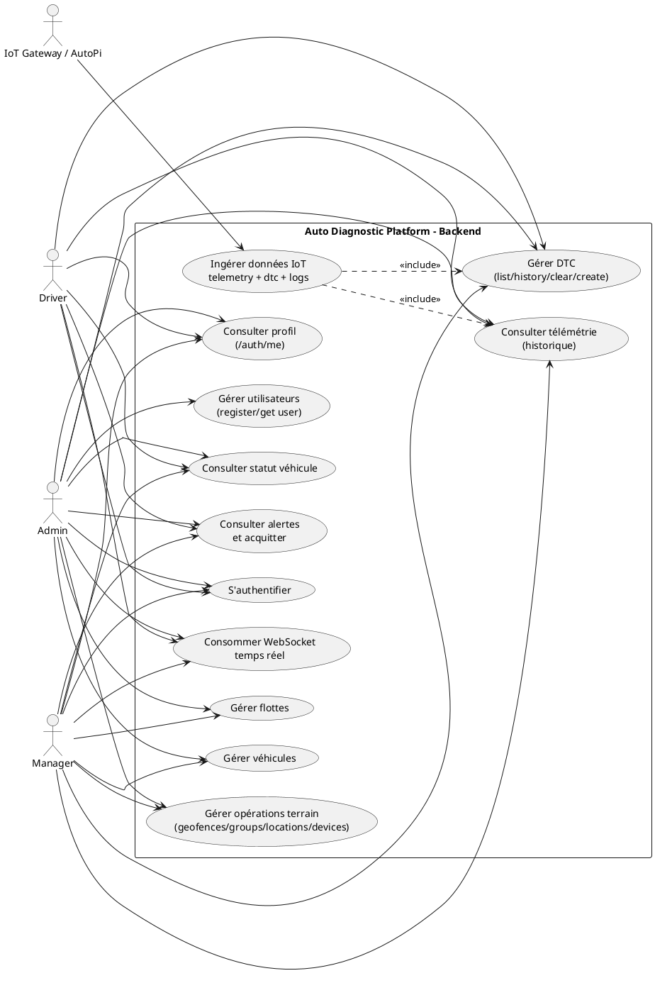

### 14.2 Diagramme de classes (domaine métier)

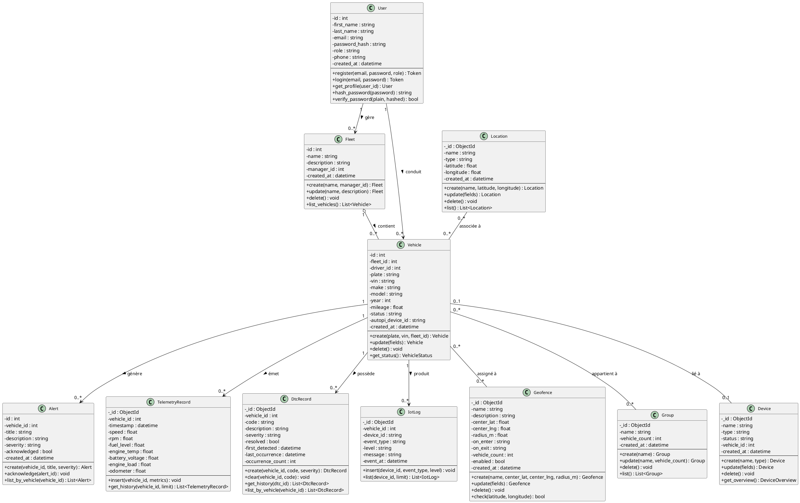

---

### 14.3 Diagrammes de séquence

#### 14.3.1 Authentification (Login)

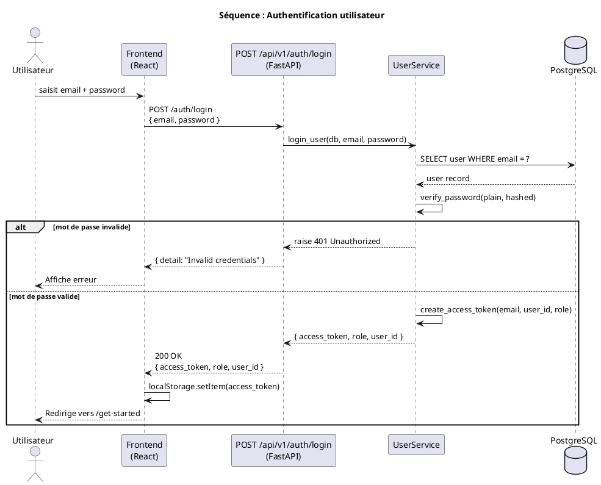

---

#### 14.3.2 Ingestion télémétrie via MQTT Gateway

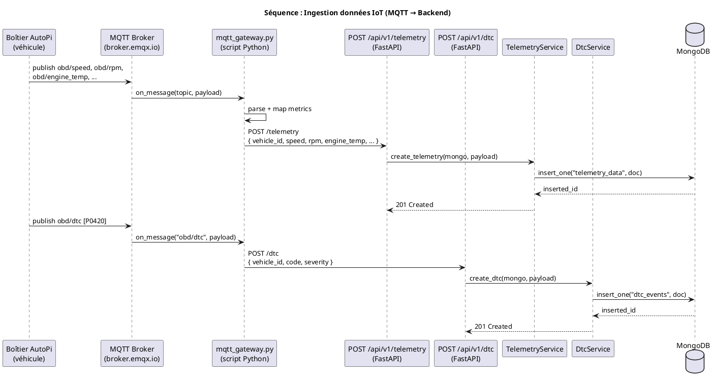

---

#### 14.3.3 Consultation statut véhicule

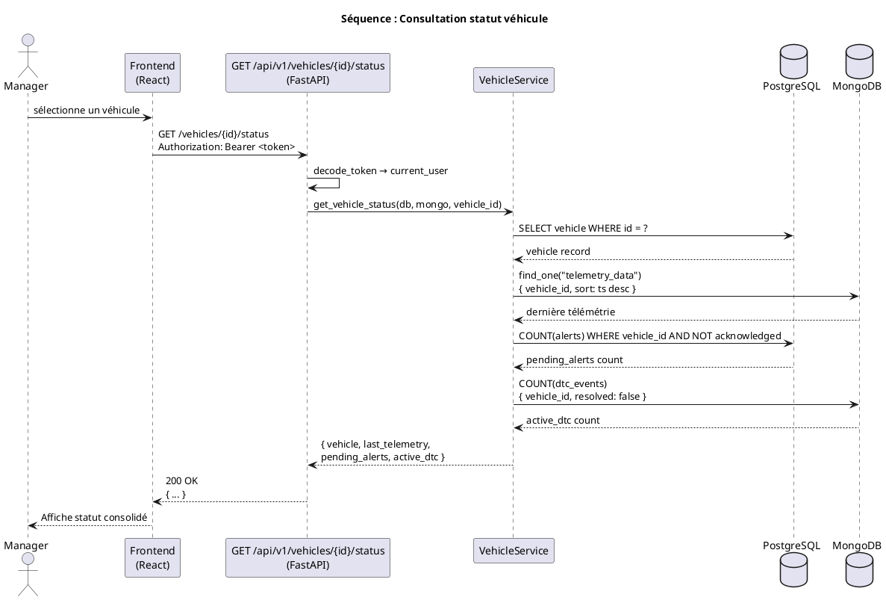

---

#### 14.3.4 Gestion DTC (liste + clear)

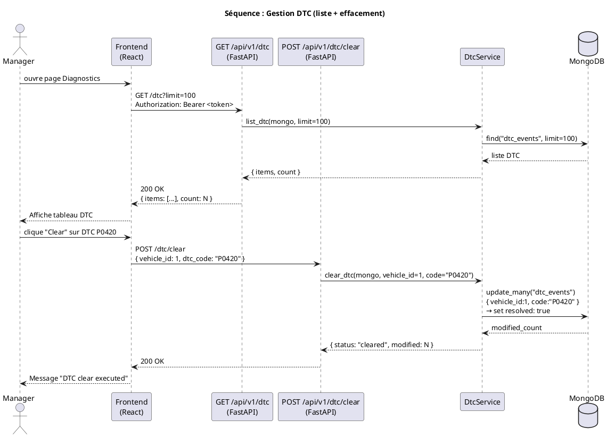

---

#### 14.3.5 WebSocket temps réel (télémétrie live)

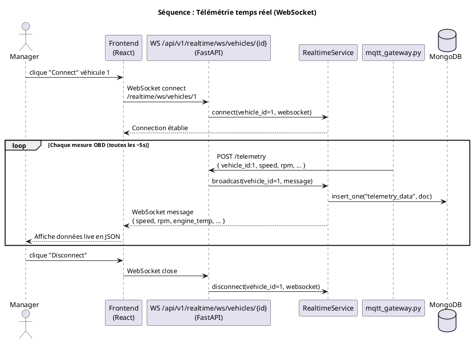

---

#### 14.3.6 Création véhicule (contrôles métier)

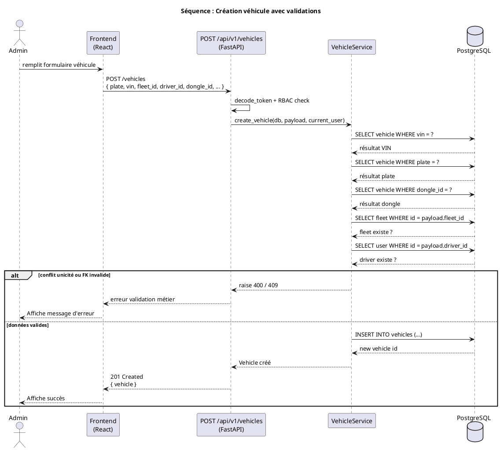

---

#### 14.3.7 Gestion flotte (création + assignation véhicule)

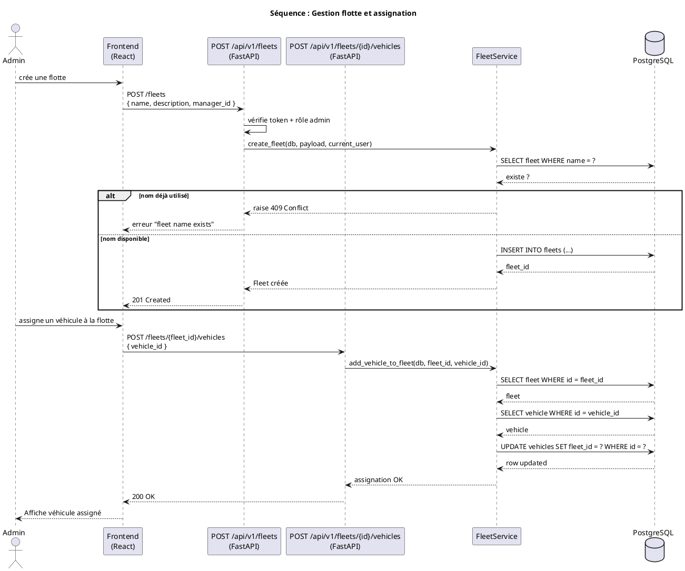

---

#### 14.3.8 Alertes (liste + acquittement)

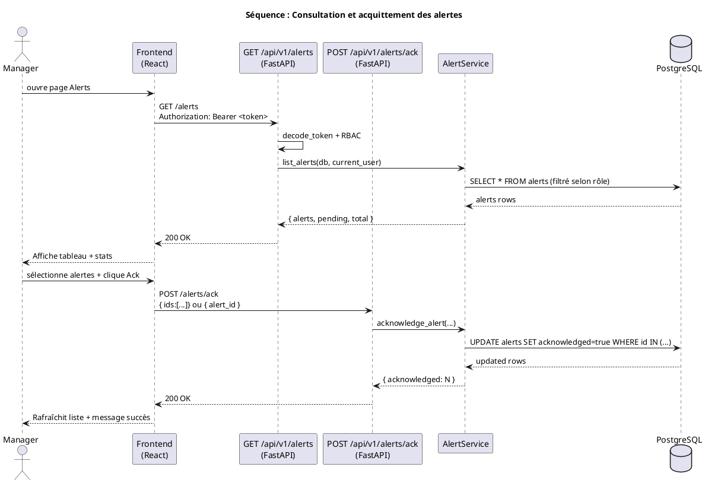

---

#### 14.3.9 Ops Geofence Check (position → zones)

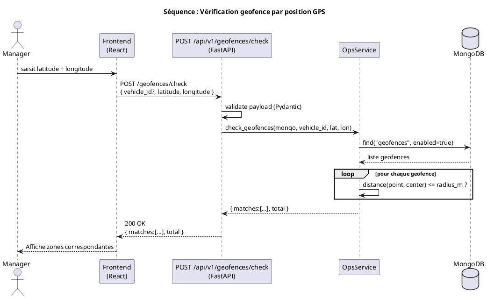
