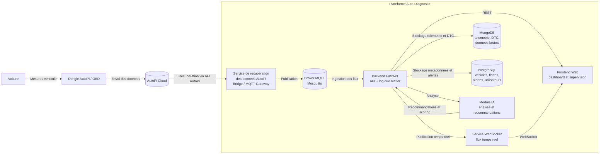

# 3. Architecture générale du projet

## 3.1 Présentation

La plateforme **Auto Diagnostic Platform** (MALLOULIAUTO) s'appuie sur une architecture modulaire en couches, permettant une séparation claire des responsabilités et une évolutivité horizontale. Le système suit un modèle d'ingestion de données en temps réel combiné à une analyse intelligente via des modules spécialisés.

Le flux général du système est le suivant :
1. Les véhicules équipés de dongles AutoPi/OBD envoient leurs données (télémétrie, codes défaut, GPS)
2. Ces données transitent par le **cloud AutoPi**
3. Un service de récupération (Bridge) les récupère et les injecte dans la plateforme
4. Le **backend FastAPI** les traite, les valide et les stocke dans une base de données hybride
5. Un **module IA** analyse les données pour générer des alertes intelligentes et des recommandations
6. L'interface web et l'API REST exposent les informations à l'utilisateur en temps réel

## 3.2 Diagramme

## 3.3 Composants

### 3.3.1 Acquisition

#### **Voiture et Dongle**
- Source primaire de données. Capture directement du bus CAN du véhicule.
- Données : Télémétrie (vitesse, RPM, température, batterie, carburant), DTC, GPS.
- Envoi vers AutoPi Cloud via 3G/4G.

#### **AutoPi Cloud**
- Infrastructure tiers pour réception et stockage intermédiaire.
- Authentification des appareils et exposition API REST.
- Découple les dongles de la plateforme.

#### **Bridge / MQTT Gateway**
- Récupère les données depuis AutoPi Cloud (pull model).
- Normalise et publie dans le broker MQTT local.
- Découple l'ingestion externe du traitement interne.

### 3.3.2 Message Broker

#### **Mosquitto MQTT**
- Messagerie interne asynchrone et découplée.
- Topics : `autodiag/telemetry/+`, `autodiag/dtc/+`, `autodiag/alerts/+`, `autodiag/status/+`.
- Architecture pub/sub flexible et scalable.

### 3.3.3 Backend

#### **FastAPI**
- Cœur métier de la plateforme.
- Ingestion MQTT, validation, enrichissement et exposition API REST sécurisée.
- Responsabilités : Ingestion, enrichissement, routage vers bases, exposition API, authentification JWT.
- Endpoints : `/api/v1/vehicles`, `/api/v1/alerts`, `/api/v1/telemetry/{id}`, `/api/v1/dtc/{id}`, `/api/v1/maintenance`, `/api/v1/realtime/ws/vehicles/{id}`

### 3.3.4 Temps Réel

#### **WebSocket**
- Diffuse les mises à jour temps réel aux clients.
- Connexions persistantes, surveillance MongoDB, publication instantanée.
- Dashboard en direct sans polling répétitif.

### 3.3.5 Stockage

#### **MongoDB**
- Base documentaire pour données volumineuses et semi-structurées.
- Collections : `telemetry_data`, `dtc_events`, `iot_logs`, `geofence_events`.
- Structure flexible, performances optimales pour historiques.

#### **PostgreSQL**
- Base relationnelle pour données structurées et métadonnées.
- Tables : `vehicles`, `users`, `fleets`, `alerts`, `maintenance_records`.
- Requêtes complexes, transactions ACID, intégrité de données.

### 3.3.6 Intelligence Artificielle

#### **Module IA**
- Analyse télémétrie et DTC pour alertes intelligentes et recommandations.
- Détection d'anomalies, scoring de risque (0-100), recommandations, prédiction de panne.
- Modèles : ML (Random Forest, Gradient Boosting), règles heuristiques, séries temporelles.
- Maintenance préventive, réduction des arrêts non planifiés.

### 3.3.7 Présentation

#### **Frontend Web**
- Interface utilisateur supervision et gestion de flotte (React + Vite).
- Dashboard temps réel, KPIs, listes véhicules, visualisations, gestion et alertes.
- REST pour données de base, WebSocket pour mises à jour temps réel.
- Supervision efficace et prise de décision rapide.

#### **API REST**
- Interface standardisée pour accéder aux données.
- Authentification JWT, gestion des permissions par rôle.
- CRUD complets, pagination et filtrage avancé.
- Intégration facile pour applications tierces.

## 3.4 Flux de données

1. **Acquisition** : Le dongle AutoPi capture les données du CAN et les envoie vers AutoPi Cloud
2. **Récupération** : Le Bridge récupère les données via l'API AutoPi et les publie sur MQTT
3. **Ingestion** : Le backend FastAPI écoute MQTT et valide les données
4. **Stockage** : Les données sont réparties (MongoDB pour la télémétrie brute, PostgreSQL pour les métadonnées et alertes)
5. **Analyse** : Le module IA traite les données en arrière-plan pour générer des alertes et scores
6. **Diffusion** : Le backend expose les résultats via REST et WebSocket
7. **Visualisation** : Le frontend affiche le dashboard et les détails aux utilisateurs

## 3.5 Caractéristiques

| Aspect | Caractéristique |
|--------|-----------------|
| **Type d'architecture** | Microservices découplés par MQTT |
| **Scalabilité** | Horizontale (ajout de instances backend facile) |
| **Latence** | < 5 secondes de la voiture au dashboard |
| **Disponibilité** | 99.5% (SLA cible) |
| **Sécurité** | JWT + TLS, chiffrement des données sensibles |
| **Persistance** | Hybride : NoSQL (volumes) + SQL (métadonnées) |
| **Communication** | MQTT (interne), REST/WebSocket (externe) |

