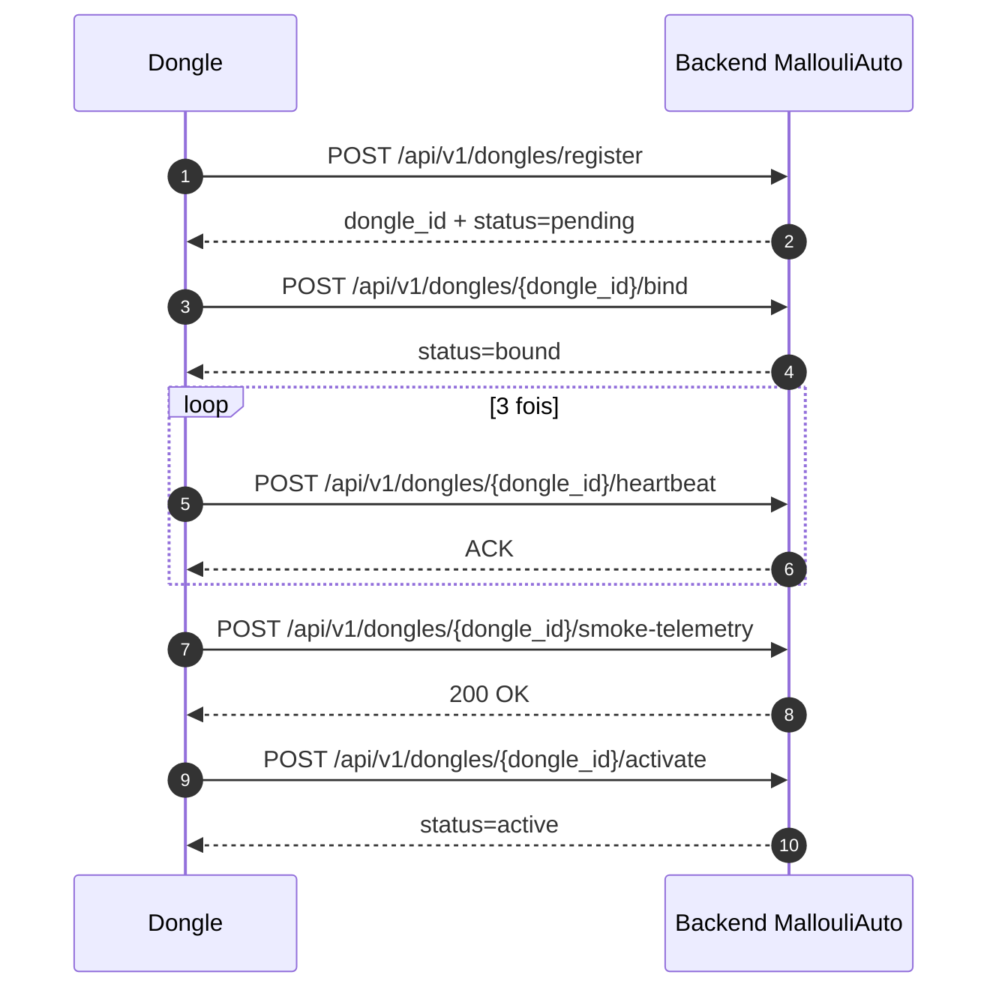

# MallouliAuto - Conception finale (Etape unique: connexion dongle -> plateforme)

## 1. Objectif

Ce document couvre uniquement l'etape d'onboarding du dongle dans MallouliAuto.

**Scope de cette phase (UNIQUEMENT):**
1. Enregistrer le dongle dans MallouliAuto.
2. Associer le dongle au bon vehicule.
3. Verifier la connectivite (heartbeat).
4. Verifier un envoi de controle (smoke telemetry).
5. Activer le dongle.

**Hors scope (phases suivantes):**
1. Configuration réseau du dongle (WiFi, 4G, etc.) - hypothèse: déjà opérationnel.
2. Lecture OBD/PID détaillée (c'est APRÈS activation).
3. Algorithmes de filtrage avancés.
4. Analyse IA et alertes métier.

---

## 2. Preconditions

Preconditions obligatoires avant de lancer l'onboarding:
1. **Le dongle est opérationnel et connecté au réseau** (WiFi, 4G, ou autre transport).
2. **On connait le serial_number du dongle** (stocké dans la config du dongle ou son EEPROM).
3. **On connait la firmware_version du dongle** (obtenue de la config du dongle ou via une requête locale).
4. Le backend MallouliAuto est joignable.
5. Le service possede un token technique valide.
6. Le `vehicle_id` cible existe deja dans la plateforme.

---

## 3. Donnees minimales requises

**Pour lancer l'onboarding (fourni par le service):**
1. `serial_number` - stocké dans le dongle lui-même
2. `dongle_type` - ex: "autopi", constante métier
3. `firmware_version` - récupéré depuis le dongle
4. `transport` - ex: "wifi", "4g", "bt" (ce qui est actif)
5. `vehicle_id` - cible MallouliAuto (préexistant)
6. `gateway_id` - ou device_id qui pilote l'onboarding

**À stocker côté MallouliAuto (retourné après chaque étape):**
1. `dongle_id` - identifiant unique MallouliAuto
2. `status` - pending → bound → active (ou blocked si erreur)
3. `vehicle_id` - lien établi au step bind
4. `last_heartbeat_at` - timestamp du dernier heartbeat réussi
5. `last_error_code` - ex: 400, 409, 503

---

## 3.5 Clarification: Architecture de connexion

### Précondition (Phase 0 - déjà faite):
- Dongle connecté au réseau (WiFi, 4G, ou autre transport)
- Dongle opérationnel et capable de faire des requêtes HTTP/HTTPS

### Connexion DIRECTE au backend MallouliAuto (Cette phase - Phases 1-5):
**Le dongle se connecte DIRECTEMENT au backend MallouliAuto, PAS à AutoPi Cloud ou à d'autres intermédiaires.**

Etapes:
1. **Register**: Envoyer serial_number, firmware_version au backend MallouliAuto → Récupérer dongle_id
2. **Bind**: Lier le dongle_id à un vehicle_id
3. **Heartbeat** (x3): Vérifier la connectivité réseau et la disponibilité du backend
4. **Smoke Test**: Envoyer une telemetry de test (rpm, speed) pour valider le flux
5. **Activate**: Marquer le dongle comme actif et prêt pour la production

### Phases suivantes (NOT in scope):
- Lire l'OBD en continu (après activation)
- Appliquer les modèles IA
- Générer les alertes métier

## 3.6 Clarification: Role de SSH dans cette conception

SSH sert a ouvrir un terminal distant sur le dongle AutoPi afin d'executer des commandes locales d'administration.

SSH est utile pour:
1. Verifier la connectivite reseau du dongle.
2. Inspecter les services actifs sur le dongle.
3. Lire les logs locaux.
4. Ajuster une configuration locale si necessaire.
5. Confirmer que le dongle est pret a envoyer ses requetes HTTPS vers MallouliAuto.

SSH n'est PAS utilise pour:
1. Transporter la telemetry metier.
2. Remplacer les endpoints REST du backend.
3. Remplacer le flux d'onboarding register -> bind -> heartbeat -> smoke telemetry -> activate.

Canaux a distinguer:
1. **Canal d'administration**: PC operateur -> SSH -> dongle.
2. **Canal metier**: dongle -> HTTPS -> backend MallouliAuto.

Methodes d'acces SSH supportees par le dongle:
1. **Hotspot local du dongle**: acces direct a `pi@local.autopi.io`.
2. **Wi-Fi local**: acces SSH via l'adresse IP locale du dongle, si l'option Allow SSH est activee.
3. **Tailscale**: acces distant securise si configure sur le dongle.
4. **WireGuard**: acces VPN si l'infrastructure l'exige.

Conclusion de conception:
- SSH fait partie des moyens d'exploitation terrain et de maintenance.
- Le flux officiel d'onboarding applicatif reste integralement base sur HTTPS vers MallouliAuto.

---

## 4. Workflow officiel (sequence unique)

Ordre obligatoire:
1. Register dongle
2. Bind dongle -> vehicle
3. Heartbeat x3
4. Smoke telemetry
5. Activate dongle

Si une sous-etape echoue, on arrete le workflow et le dongle reste non actif.



### 4.1 Detail de l'etape 0 - Verification terrain avant onboarding

But:
S'assurer que le dongle est joignable, qu'il a un acces reseau, et qu'il est techniquement pret a lancer le flux applicatif.

Acteur principal:
Operateur terrain ou technicien integrateur.

Entrees minimales:
1. Un dongle allume.
2. Un acces reseau deja disponible sur le dongle.
3. Les informations d'identification minimales du dongle.
4. L'URL du backend MallouliAuto.
5. Le token technique necessaire aux appels HTTPS.

Verification recommandee:
1. Verifier que le dongle demarre correctement.
2. Verifier que le dongle a un reseau fonctionnel.
3. Si necessaire, ouvrir une session SSH pour verifier l'etat local.
4. Verifier que le backend est joignable.
5. Verifier que `vehicle_id` existe deja dans MallouliAuto.

Sortie attendue:
1. Le dongle est declare pret pour l'onboarding.
2. Le canal HTTPS vers MallouliAuto est considere exploitable.

Critere d'arret:
1. Si le dongle n'a pas de reseau, on stoppe.
2. Si le backend n'est pas joignable, on stoppe.
3. Si le token est absent ou invalide, on stoppe.

### 4.2 Detail de l'etape 1 - Register dongle

But:
Creer ou retrouver l'identite applicative du dongle dans MallouliAuto.

Donnees envoyees:
1. `serial_number`
2. `dongle_type`
3. `firmware_version`
4. `transport`
5. `gateway_id`

Traitement attendu cote backend:
1. Valider le payload.
2. Verifier l'authentification technique.
3. Rechercher si le dongle existe deja par identifiant stable.
4. Creer le dongle si absent.
5. Retourner `dongle_id` et le statut `pending`.

Resultat attendu cote dongle:
1. Memoriser `dongle_id` pour les etapes suivantes.
2. Considérer que l'etape register est terminee uniquement si la reponse est valide.

Cas d'echec a gerer:
1. `400` si donnees manquantes ou invalides.
2. `401` si token invalide.
3. `503` si backend indisponible.

Condition de passage a l'etape suivante:
1. `dongle_id` est recu et exploitable.

### 4.3 Detail de l'etape 2 - Bind dongle vers vehicule

But:
Associer formellement le dongle a un vehicule existant dans MallouliAuto.

Donnees envoyees:
1. `dongle_id`
2. `vehicle_id`

Traitement attendu cote backend:
1. Verifier que le dongle existe.
2. Verifier que le vehicule existe.
3. Verifier qu'il n'y a pas de conflit de liaison.
4. Enregistrer l'association dongle -> vehicule.
5. Retourner le statut `bound`.

Resultat attendu cote dongle:
1. Le dongle sait a quel `vehicle_id` il est rattache.
2. Les futurs heartbeats et envois de controle utilisent cette association.

Cas d'echec a gerer:
1. `404` si dongle ou vehicule introuvable.
2. `409` si le dongle est deja lie a un autre vehicule ou si la regle metier bloque l'association.

Condition de passage a l'etape suivante:
1. La liaison est enregistree et le statut retourne est `bound`.

### 4.4 Detail de l'etape 3 - Heartbeat de verification

But:
Valider que le canal de communication entre le dongle et MallouliAuto est stable avant d'autoriser l'activation.

Regle de conception:
1. Trois heartbeats consecutifs doivent etre recus avec succes.
2. Les heartbeats doivent etre espaces de maniere coherente selon la politique de retry et de temporisation definie.

Donnees envoyees:
1. `dongle_id`
2. Horodatage `ts`

Traitement attendu cote backend:
1. Verifier que le dongle existe et est dans un etat compatible avec l'onboarding.
2. Mettre a jour `last_heartbeat_at`.
3. Retourner un acquittement avec l'heure serveur.

Resultat attendu cote dongle:
1. Le dongle compte les ACK reussis.
2. Le dongle ne passe a l'etape suivante qu'apres 3 succes consecutifs.

Cas d'echec a gerer:
1. Timeout reseau.
2. `503` backend indisponible.
3. Reponse incoherente ou non exploitable.

Condition de passage a l'etape suivante:
1. Trois heartbeats consecutifs sont confirmes.

### 4.5 Detail de l'etape 4 - Smoke telemetry

But:
Verifier que le backend accepte un premier envoi de donnees metier simple avant l'activation definitive.

Donnees envoyees:
1. `dongle_id`
2. `vehicle_id`
3. `ts`
4. `rpm`
5. `speed`

Regle de conception:
1. Le payload doit etre volontairement simple.
2. Cette etape ne vise pas encore la production complete des trames OBD/CAN.
3. Cette etape valide uniquement le pipeline minimal d'ingestion.

Traitement attendu cote backend:
1. Verifier l'association dongle -> vehicule.
2. Verifier la structure minimale de la telemetry.
3. Accepter et tracer cet envoi de controle.

Resultat attendu cote dongle:
1. Le test est marque comme reussi uniquement si le backend retourne `accepted=true` ou un succes equivalent.

Cas d'echec a gerer:
1. Payload rejete.
2. Association dongle/vehicule invalide.
3. Echec reseau ou indisponibilite backend.

Condition de passage a l'etape suivante:
1. Le smoke test est accepte sans ambiguite.

### 4.6 Detail de l'etape 5 - Activate dongle

But:
Basculer le dongle dans un etat applicatif `active`, ce qui clot l'onboarding.

Donnees envoyees:
1. `dongle_id`
2. `reason=onboarding_completed`

Traitement attendu cote backend:
1. Verifier que toutes les etapes precedentes sont reussies.
2. Changer le statut du dongle en `active`.
3. Journaliser l'evenement final d'activation.

Resultat attendu cote dongle:yes
1. Le dongle considere l'onboarding comme termine.
2. Le dongle peut passer ensuite aux flux de collecte previs par les phases futures.

Cas d'echec a gerer:
1. Activation appelee trop tot.
2. Incoherence d'etat dans le backend.
3. Erreur backend ou reseau.

Condition de fin:
1. Le statut retourne est `active`.
2. Le backend et le dongle sont coherents sur cet etat final.

---

## 5. Contrat API minimal (etape onboarding)

### 5.1 Register dongle

`POST /api/v1/dongles/register`

Request:
```json
{
  "serial_number": "AUTO123456",
  "dongle_type": "autopi",
  "firmware_version": "1.2.0",
  "transport": "wifi",
  "gateway_id": "GW-01"
}
```

Response 201:
```json
{
  "dongle_id": "DNG-0001",
  "status": "pending"
}
```

### 5.2 Bind dongle

`POST /api/v1/dongles/{dongle_id}/bind`

Request:
```json
{
  "vehicle_id": "VEH-0001"
}
```

Response 200:
```json
{
  "dongle_id": "DNG-0001",
  "vehicle_id": "VEH-0001",
  "status": "bound"
}
```

### 5.3 Heartbeat

`POST /api/v1/dongles/{dongle_id}/heartbeat`

Request:
```json
{
  "ts": "2026-06-17T10:00:00Z"
}
```

Response 200:
```json
{
  "ack": true,
  "server_time": "2026-06-17T10:00:00Z"
}
```

### 5.4 Smoke telemetry

`POST /api/v1/dongles/{dongle_id}/smoke-telemetry`

Request:
```json
{
  "vehicle_id": "VEH-0001",
  "ts": "2026-06-17T10:00:01Z",
  "rpm": 900,
  "speed": 0
}
```

Response 200:
```json
{
  "accepted": true
}
```

### 5.5 Activate dongle

`POST /api/v1/dongles/{dongle_id}/activate`

Request:
```json
{
  "reason": "onboarding_completed"
}
```

Response 200:
```json
{
  "dongle_id": "DNG-0001",
  "status": "active"
}
```

### 5.6 Codes d'erreur minimum

1. `400` payload invalide
2. `401` token invalide/expire
3. `404` dongle ou vehicle introuvable
4. `409` conflit de binding
5. `503` backend indisponible

---

## 6. Regles GO / NO-GO

GO si:
1. Register reussi.
2. Bind reussi.
3. 3 heartbeats consecutifs recus.
4. Smoke telemetry acceptee.
5. Status final = `active`.

NO-GO si:
1. Auth echec.
2. Vehicle introuvable.
3. Conflit de binding.
4. Heartbeat non recu.
5. Smoke telemetry rejetee.

---

## 7. Retry et reprise

Regles minimales de reprise:
1. Retry exponentiel sur erreurs transitoires (`503`, timeout reseau).
2. Pas de retry aveugle sur erreurs fonctionnelles (`400`, `409`).
3. Idempotency key sur `register` et `bind` pour eviter doublons.
4. Si echec final: statut `blocked` + journalisation de `last_error_code`.

Backoff recommande:
1. Tentative 1: 3s
2. Tentative 2: 6s
3. Tentative 3: 12s
4. Tentative 4: 24s
5. Maximum: 48s

---

## 8. Logging minimal obligatoire

Evenements obligatoires:
1. `DONGLE_REGISTERED`
2. `DONGLE_BOUND`
3. `DONGLE_HEARTBEAT_OK`
4. `DONGLE_SMOKE_OK`
5. `DONGLE_ACTIVATED`
6. `DONGLE_ONBOARDING_FAILED`

Champs minimaux par log:
1. `timestamp`
2. `dongle_id`
3. `vehicle_id`
4. `step`
5. `status`
6. `http_status`
7. `error_code`
8. `error_message`

---

## 9. Checklist execution terrain

Checklist operateur:
1. Verifier token service.
2. Verifier backend joignable.
3. Si necessaire, ouvrir une session SSH sur le dongle pour verifier l'etat local (reseau, services, logs).
4. Lancer register.
5. Verifier `dongle_id` retourne.
6. Lancer bind avec `vehicle_id`.
7. Verifier 3 heartbeats consecutifs.
8. Envoyer smoke telemetry.
9. Activer dongle.
10. Verifier statut final `active` en base.

Definition of Done de l'etape:
1. Le dongle apparait `active` dans MallouliAuto.
2. Le dongle est lie au bon `vehicle_id`.
3. Les logs d'onboarding sont complets et tracables.

---

## 10. Architecture finale: Connexion directe

**Le dongle communique DIRECTEMENT avec le backend MallouliAuto.**

Aucune dépendance à AutoPi Cloud, API AutoPi, ou services tiers.

Le seul acces lateral autorise pour l'operateur est un acces SSH d'administration sur le dongle. Cet acces ne transporte pas la telemetry metier; il sert uniquement au diagnostic, a l'inspection et a la maintenance.

Flux:
```
Dongle (serial_number, firmware_version) 
  ↓ (HTTP/HTTPS)
Backend MallouliAuto
  ↓
Dongle devient "active"
```

Flux d'exploitation terrain:
```
PC operateur
  ↓ (SSH)
Dongle

Dongle
  ↓ (HTTPS)
Backend MallouliAuto
```

---

## 11. Decision de cadrage (cette phase)

Pour cette phase, on ne traite que l'onboarding plateforme.

Decision:
1. La lecture OBD est consideree deja operationnelle (APRÈS activation).
2. Aucun ajout fonctionnel hors onboarding n'est autorise dans ce lot.
3. Les autres manques seront traites dans un lot suivant.
