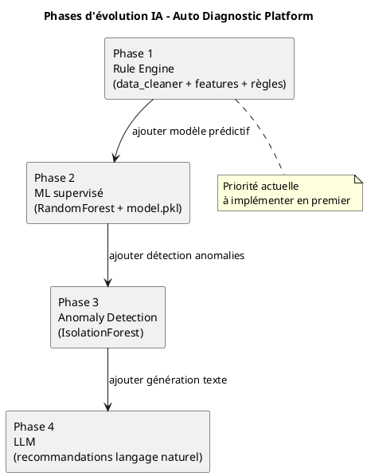
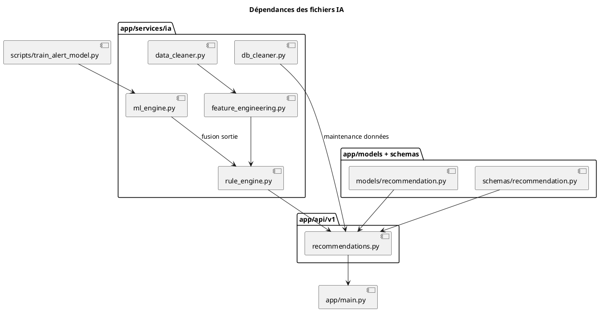
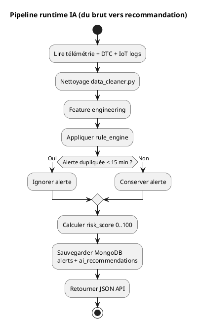
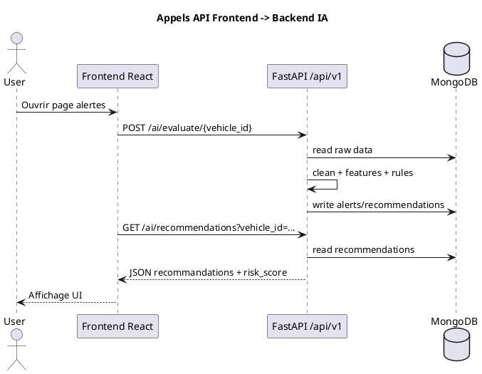

# Conception IA — Alertes Intelligentes & Recommandations de Diagnostic

---

## 1. Comment fonctionne la partie IA (flux simplifié)

### Chemin des données étape par étape :

**ÉTAPE 1 → EXTRACTION DES DONNÉES**
- Le backend reçoit les données OBD du dongle AutoPi via MQTT
- Stockage dans MongoDB (collections: telemetry, dtc_records, iot_logs)
- Source : MongoDB + PostgreSQL

**ÉTAPE 2 → NETTOYAGE DES DONNÉES**
- Fichier : `backend/app/services/ia/data_cleaner.py`
- Qu'est-ce qu'on nettoie :
  - Supprimer les valeurs nulles (capteur défaillant)
  - Supprimer les valeurs impossibles (RPM = 99999, Temp = -500°C)
  - Supprimer les doublons (même timestamp 2 fois)
  - Convertir les timestamps en format correct
- Résultat : DataFrame pandas propre

**ÉTAPE 3 → CRÉER LES FEATURES (variables utiles)**
- Fichier : `backend/app/services/ia/feature_engineering.py`
- Qu'est-ce qu'on crée :
  - Moyennes glissantes : moyenne RPM sur 5 min, moyenne temp sur 5 min
  - Tendances : la batterie monte-t-elle ou baisse-t-elle ?
  - Flags (drapeaux) : is_idling (ralenti) oui/non, is_overheating (surchauffe) oui/non
  - Durée :ombien de temps en ralenti continu ?
- Résultat : DataFrame avec 15-20 colonnes bien structurées

**ÉTAPE 4 → APPLIQUER LES RÈGLES MÉTIER**
- Fichier : `backend/app/services/ia/rule_engine.py`
- 10 règles simples basées sur l'expérience mécanique :
  - SI battery < 11.8V → alerte CRITICAL + recommandation "vérifier batterie"
  - SI engine_temp > 105°C → alerte CRITICAL + recommandation "arrêter véhicule"
  - SI DTC P0300 → recommandation "vérifier bougies/bobines"
  - SI fuel < 10% → recommandation "faire le plein"
  - etc.
- Résultat : liste d'ALERTES + RECOMMANDATIONS

**ÉTAPE 5 → CALCULER SCORE DE RISQUE (0-100)**
- Chaque alerte et recommandation a un poids :
  - Alerte critical = +30 points
  - Alerte warning = +15 points
  - Recommandation high = +20 points
  - Recommandation medium = +10 points
- Total plafonné à 100
- Résultat : score global 0-100 par véhicule

**ÉTAPE 6 → ÉVITER LES DOUBLONS**
- Pas créer 10 alertes identiques en 5 minutes
- Règle : ignorer l'alerte si une identique existe depuis moins de 15 minutes
- Résultat : alertes non-spam

**ÉTAPE 7 → SAUVEGARDER LES RÉSULTATS**
- Collections MongoDB créées :
  - `alerts` : stocke les alertes
  - `ai_recommendations` : stocke les recommandations
- API expose ces données : `GET /api/v1/alerts`, `GET /api/v1/ai/recommendations`

---

## 2. Comment nettoyer les données (détail ÉTAPE 2)

### Nettoyage étape par étape :

1. **Convertir les timestamps** (string → datetime)
   - Avant : `"2026-03-31 10:00:00"`
   - Après : `Timestamp('2026-03-31 10:00:00', tz='UTC')`

2. **Supprimer lignes sans timestamp valide**
   - Si timestamp manquant → ligne supprimée

3. **Trier par temps croissant**
   - Assure que les données sont dans l'ordre chronologique

4. **Supprimer doublons exacts**
   - Si même vehicle_id + même timestamp deux fois → garder une seule

5. **Vérifier seuils valides par capteur**
   ```
   RPM:            valide entre 0 et 8000
   SPEED:          valide entre 0 et 300 km/h
   ENGINE_TEMP:    valide entre -40 et 130°C
   FUEL_LEVEL:     valide entre 0 et 100%
   BATTERY_VOLTAGE: valide entre 9V et 16V
   ```
   - Si hors seuil → remplacer par vide (NaN)

6. **Interpolation linéaire** (combler les trous)
   - Si 3 points manquent entre 2 bons points → remplir avec valeurs intermédiaires
   - Utile quand capteur temporairement offline

7. **Remplir NaN restants avec médiane**
   - Calcule la valeur médiane de la colonne
   - Remplace les vides avec cette médiane

### Résultat final :
- DataFrame sans NaN, sans valeurs impossibles, sans doublons
- Prêt pour feature engineering

---

## 3. Comment créer les features (détail ÉTAPE 3)

### Variables créées :

**Moyennes glissantes (rolling windows 5 minutes) :**
- `rpm_mean_5m` : moyenne RPM des 5 derniers points
- `speed_mean_5m` : moyenne vitesse des 5 derniers points
- `engine_temp_mean_5m` : moyenne température des 5 derniers points

**Maxima glissants :**
- `engine_temp_max_5m` : température MAX des 5 derniers points
- `rpm_max_5m` : RPM MAX des 5 derniers points

**Tendances :**
- `battery_trend` : pente de la batterie (monte-t-elle ou baisse-t-elle ?)
  - Calcul : polyfit() sur 10 derniers points
  - Si positif : batterie se recharge
  - Si négatif : batterie se décharge

**Flags binaires (0 ou 1) :**
- `is_idling` = 1 SI (speed < 5 km/h ET rpm > 600)
- `is_overheating` = 1 SI (engine_temp > 100°C)
- `is_battery_low` = 1 SI (battery_voltage < 11.8V)
- `is_overspeed` = 1 SI (speed > 200 km/h)

**Durée :**
- `idle_duration_min` : nombre de minutes consécutives en ralenti
  - Utile pour détecter : ralenti prolongé = anormal

### Résultat final :
- DataFrame enrichi avec ~20 colonnes
- Prêt pour rule engine

---

## 4. Règles métier appliquées (détail ÉTAPE 4)

### Règle 1 : Batterie critique
```
SI battery_voltage < 11.8V :
  → ALERTE : severity = CRITICAL
  → TITRE : "Batterie critique"
  → MESSAGE : "Tension : 11.5V (seuil : 11.8V)"
  → RECOMMANDATION priority=HIGH : "Vérifier alternateur, remplacer batterie"
  → RISK_SCORE += 30
```

### Règle 2 : Batterie faible
```
SI 11.8 <= battery_voltage < 12.2V :
  → ALERTE : severity = WARNING
  → TITRE : "Batterie faible"
  → RISK_SCORE += 15
```

### Règle 3 : Surchauffe moteur
```
SI engine_temp > 105°C :
  → ALERTE : severity = CRITICAL
  → TITRE : "Surchauffe moteur"
  → RECOMMANDATION priority=HIGH : "Arrêter immédiatement, vérifier liquide refroidissement"
  → RISK_SCORE += 30
```

### Règle 4 : Température élevée
```
SI 95 < engine_temp <= 105°C :
  → ALERTE : severity = WARNING
  → TITRE : "Température moteur élevée"
  → RISK_SCORE += 15
```

### Règle 5-12 : Codes DTC
```
Pour chaque code DTC (P0300, P0301, P0420, P0171, etc.) :
  → Mapper vers recommandation spécifique
  Exemples :
  - P0300 → "Ratés multiples : vérifier bougies, bobines, injecteurs"
  - P0420 → "Catalyseur défaillant : vérifier sonde lambda"
  - P0171 → "Mélange pauvre : vérifier injecteurs, sonde MAF"
```

### Règle 13 : Carburant bas
```
SI fuel_level < 10% :
  → ALERTE : severity = WARNING
  → TITRE : "Carburant très bas"
  → RISK_SCORE += 10
```

---

## 5. Score de risque : comment calculer (détail ÉTAPE 5)

### Algorithme simple :

```
score = 0

POUR CHAQUE alerte :
  SI severity == CRITICAL :
    score += 30
  SI severity == WARNING :
    score += 15
  SI severity == INFO :
    score += 5

POUR CHAQUE recommandation :
  SI priority == HIGH :
    score += 20
  SI priority == MEDIUM :
    score += 10
  SI priority == LOW :
    score += 5

score = MIN(score, 100)  ← plafonner à 100
```

### Exemple concret :
```
Scénario : batterie 11.5V + temp moteur 106°C

Alerte 1 : battery CRITICAL  → score += 30
Alerte 2 : temp CRITICAL     → score += 30
Recom 1 : battery HIGH       → score += 20
Recom 2 : temp HIGH          → score += 20

score = 30 + 30 + 20 + 20 = 100 (plafonné)
Risk = 100 = 🔴 CRITIQUE
```

---

## 6. Déduplication : éviter le spam (détail ÉTAPE 6)

### Problème :
La même alerte peut être générée toutes les minutes pendant 10 minutes
→ 10 alertes identiques = mauvaise expérience

### Solution :
```
QUAND on génère une nouvelle alerte BATT_001 :
  1. Chercher dans MongoDB si alerte (vehicle_id=1, rule_code=BATT_001) existe
  2. Chercher SEULEMENT dans les 15 dernières minutes
  3. SI trouvé → IGNORER la nouvelle alerte
  4. SI pas trouvé → CRÉER la nouvelle alerte
```

### Exemple :
```
10:00 → Première alerte BATT_001 créée ✓
10:01 → Deuxième BATT_001 générée → trouvée dans les 15 min → IGNORÉE ✗
10:02 → Troisième BATT_001 générée → trouvée dans les 15 min → IGNORÉE ✗
...
10:15 → Alerte plus vieille que 15 min → CRÉER NEW BATT_001 ✓
```

---

## 7. Où vont les résultats (détail ÉTAPE 7)

### MongoDB collections créées :

**Collection 1 : `alerts`**
```json
{
  "_id": "ObjectId()",
  "vehicle_id": 1,
  "alert_type": "battery",          ← type d'alerte
  "severity": "critical",            ← info / warning / critical
  "title": "Batterie critique",
  "message": "Tension batterie 11.5V",
  "rule_code": "BATT_001",           ← code interne de la règle
  "value": 11.5,
  "is_acknowledged": false,          ← utilisateur a-t-il accepté l'alerte ?
  "created_at": "2026-03-31T10:00:00Z"
}
```

**Collection 2 : `ai_recommendations`**
```json
{
  "_id": "ObjectId()",
  "vehicle_id": 1,
  "source": "rule_engine",           ← ou "ml_model" en phase 2
  "priority": "high",                ← low / medium / high
  "title": "Batterie à remplacer",
  "recommendation_text": "La  batterie...",
  "reason": "BATT_001",              ← code règle ou DTC
  "estimated_risk_score": 85.0,
  "is_read": false,                  ← utilisateur a-t-il lu ?
  "created_at": "2026-03-31T10:00:00Z"
}
```

### API endpoints :

```
GET /api/v1/alerts?vehicle_id=1
  → retourne tous les alerts du véhicule

GET /api/v1/alerts?vehicle_id=1&severity=critical
  → retourne SEULEMENT alertes critical

GET /api/v1/ai/recommendations?vehicle_id=1&priority=high
  → retourne recommandations priority=high

GET /api/v1/ai/risk-score/1
  → retourne score 0-100 du véhicule

POST /api/v1/ai/evaluate/1
  → lancer évaluation IA manuelle pour véhicule 1
```

---

## 8. Phases d'évolution

Cette section répond à la question : **"Quelles étapes j'applique, dans quel ordre, et dans quels fichiers ?"**

### Phase 1 (Maintenant) : Rule Engine (obligatoire)

Objectif : avoir un système IA utile sans entraînement ML.

Étapes exactes :

1. **Créer le dossier IA backend**
   - Chemin : `backend/app/services/ia/`
   - Fichiers à créer :
     - `backend/app/services/ia/__init__.py`
     - `backend/app/services/ia/data_cleaner.py`
     - `backend/app/services/ia/feature_engineering.py`
     - `backend/app/services/ia/rule_engine.py`
     - `backend/app/services/ia/db_cleaner.py`

2. **Implémenter nettoyage + features**
   - `data_cleaner.py` : timestamps, doublons, outliers, interpolation
   - `feature_engineering.py` : rolling mean, max, trend, flags, idle duration

3. **Implémenter le moteur de règles**
   - `rule_engine.py`
   - Règles min recommandées :
     - batterie critique/faible
     - température critique/élevée
     - DTC critiques (P0300..P0304, P0420, P0171, ...)
     - carburant bas

4. **Créer la persistance recommandations**
   - Modèle : `backend/app/models/recommendation.py`
   - Schéma : `backend/app/schemas/recommendation.py`

5. **Exposer les endpoints IA**
   - `backend/app/api/v1/recommendations.py`
   - Endpoints min :
     - `POST /api/v1/ai/evaluate/{vehicle_id}`
     - `GET /api/v1/ai/recommendations?vehicle_id=...`
     - `GET /api/v1/ai/risk-score/{vehicle_id}`

6. **Brancher le routeur dans le backend**
   - Fichier : `backend/app/main.py`
   - Ajouter le router recommandations dans l'API v1

7. **Tester manuellement**
   - Lancer backend : `docker compose up -d --build`
   - Appeler `POST /api/v1/ai/evaluate/1`
   - Vérifier MongoDB : collections `alerts`, `ai_recommendations`

Critère de sortie Phase 1 :
- Pour un cas batterie faible, une alerte + une recommandation sont créées et visibles via API.

### Phase 2 (Plus tard) : Machine Learning supervisé

Objectif : compléter les règles avec un modèle prédictif.

Étapes exactes :

1. Ajouter script entraînement : `backend/scripts/train_alert_model.py`
2. Charger dataset CSV (Kaggle) depuis `backend/data/raw/`
3. Réutiliser les mêmes features que la Phase 1
4. Entraîner `RandomForestClassifier`
5. Sauvegarder modèle : `backend/models/alert_classifier.pkl`
6. Créer service `backend/app/services/ia/ml_engine.py`
7. Combiner sortie `rule_engine` + `ml_engine` (priorité aux règles critiques)

Critère de sortie Phase 2 :
- `f1-score` acceptable et endpoint IA retourne `source = rule_engine` ou `source = ml_model`.

### Phase 3 (Après) : Anomaly Detection

Objectif : détecter des comportements anormaux sans labels parfaits.

Étapes :
1. Ajouter `IsolationForest` dans `ml_engine.py`
2. Score anomalie par fenêtre temporelle
3. Générer alerte `anomaly` si score dépasse seuil

### Phase 4 (Futur) : LLM (texte intelligent)

Objectif : produire une recommandation naturelle et compréhensible.

Étapes :
1. Construire un résumé structuré (alertes + DTC + contexte)
2. Envoyer au LLM via API
3. Stocker texte final dans `ai_recommendations.recommendation_text`
4. Garder un fallback local si API externe indisponible

### Diagramme bloc PlantUML — Phases d'évolution



---

## 9. Fichiers à créer (ordre d'implémentation)

### 9.1 Arborescence cible

```text
backend/
  app/
    api/
      v1/
        recommendations.py
    models/
      recommendation.py
    schemas/
      recommendation.py
    services/
      ia/
        __init__.py
        data_cleaner.py
        feature_engineering.py
        rule_engine.py
        db_cleaner.py
        ml_engine.py              # Phase 2
        scheduler.py              # optionnel
  scripts/
    train_alert_model.py          # Phase 2
  models/
    alert_classifier.pkl          # généré après entraînement
  data/
    raw/
      <dataset>.csv
```

### 9.2 Plan de travail détaillé (jour par jour)

| Jour | Action | Fichier(s) |
|---|---|---|
| J1 | Créer structure IA + nettoyage | `services/ia/data_cleaner.py` |
| J2 | Créer features techniques | `services/ia/feature_engineering.py` |
| J3 | Écrire règles métier et score risque | `services/ia/rule_engine.py` |
| J4 | Créer modèle + schéma recommandation | `models/recommendation.py`, `schemas/recommendation.py` |
| J5 | Créer API recommandations | `api/v1/recommendations.py`, `main.py` |
| J6 | Tests end-to-end (POST evaluate -> GET results) | tests API + Mongo vérification |
| J7 | Entraînement ML (optionnel phase 2) | `scripts/train_alert_model.py`, `services/ia/ml_engine.py` |

### 9.3 Checklist de validation à chaque fin de jour

- Les imports du module IA passent sans erreur
- Les endpoints IA répondent HTTP 200
- Les collections MongoDB sont alimentées
- Aucune alerte dupliquée < 15 min
- Le score de risque est toujours entre 0 et 100

### Diagramme bloc PlantUML — Fichiers et dépendances



---

## 10. Résumé du flux complet (A à Z)

### 10.1 Flux d'exécution opérationnel (ce que le backend fait)

1. Lire les données véhicule depuis MongoDB/PostgreSQL
2. Nettoyer les données (`data_cleaner.py`)
3. Créer les features (`feature_engineering.py`)
4. Exécuter les règles (`rule_engine.py`)
5. Dédupliquer les alertes
6. Calculer le score de risque
7. Sauvegarder `alerts` + `ai_recommendations`
8. Retourner la réponse API au frontend

### 10.2 Pipeline runtime (PlantUML)



### 10.3 Chemin d'appel API côté frontend



### 10.4 Commandes de test rapide (Phase 1)

```bash
cd "C:\auto diagnostic platform\backend"
docker compose up -d --build

# 1) Évaluer un véhicule
curl -X POST "http://127.0.0.1:8000/api/v1/ai/evaluate/1" \
  -H "Authorization: Bearer <TOKEN>"

# 2) Lire recommandations
curl "http://127.0.0.1:8000/api/v1/ai/recommendations?vehicle_id=1" \
  -H "Authorization: Bearer <TOKEN>"

# 3) Lire score
curl "http://127.0.0.1:8000/api/v1/ai/risk-score/1" \
  -H "Authorization: Bearer <TOKEN>"
```


