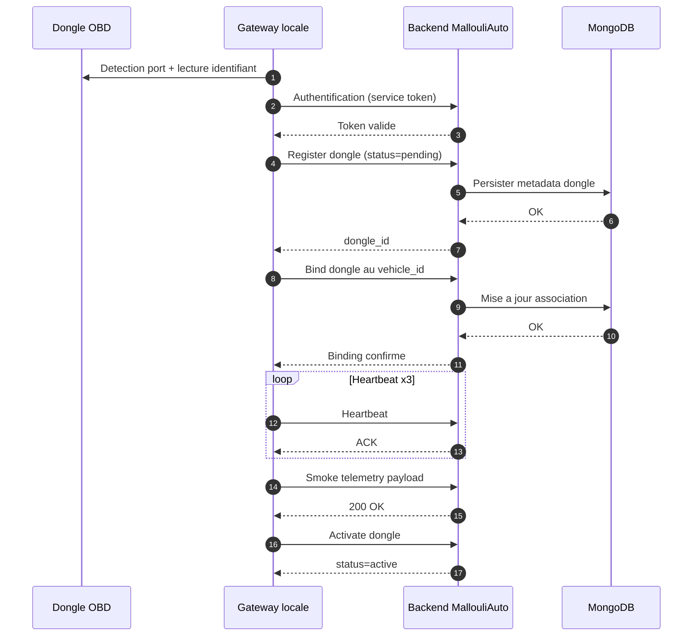
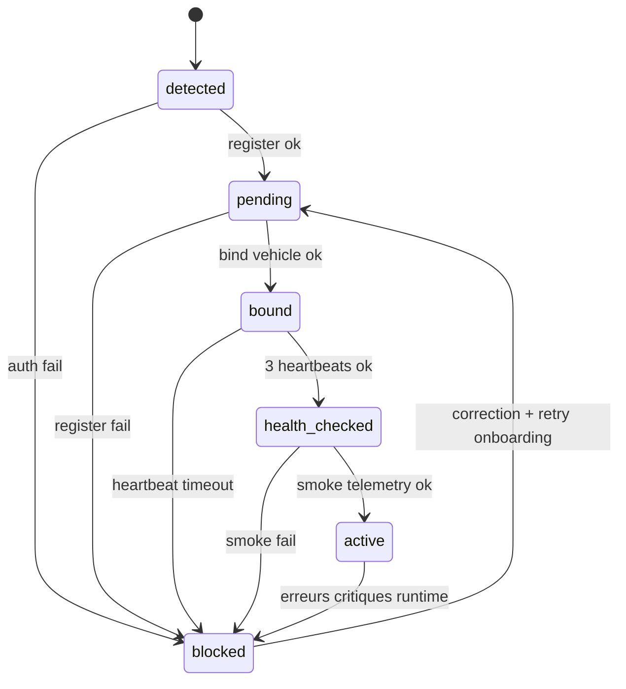
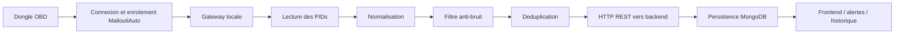
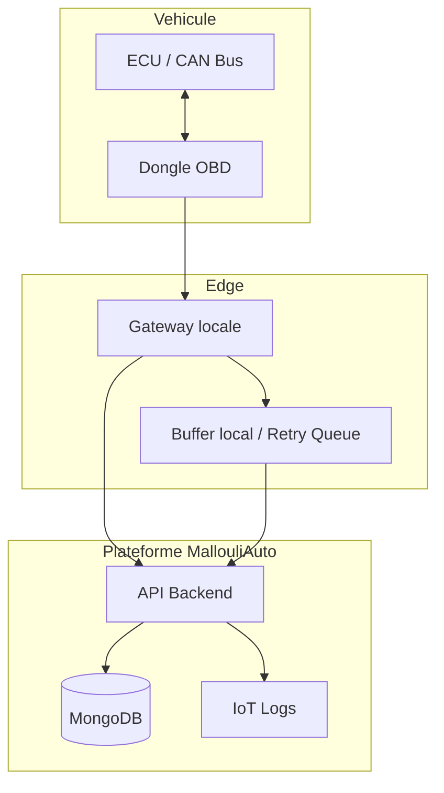
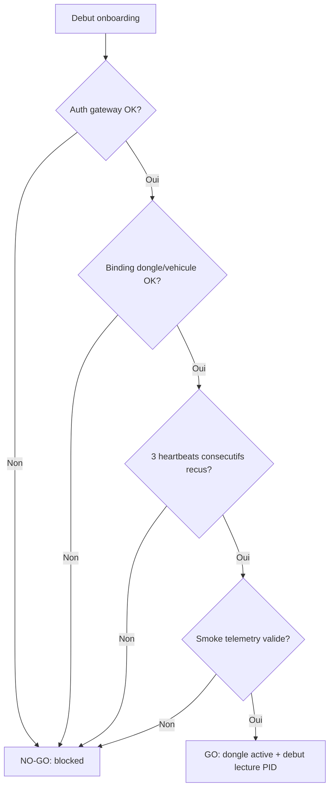

# MallouliAuto - Conception detaillee de la lecture directe depuis le dongle

## 1. Objectif

L'objectif de cette conception est de lire les donnees du vehicule directement depuis un dongle OBD, sans passer par AutoPi ni MQTT.

Le principe est simple:
- le dongle est branche sur le port diagnostic du vehicule,
- le dongle est d'abord connecte et enregistre dans la plateforme MallouliAuto,
- la gateway locale interroge le vehicule,
- les donnees sont normalisees,
- puis elles sont envoyees au backend par HTTP REST.

Cette approche garde l'architecture plus simple, plus directe et plus facile a expliquer en demo ou en production pilote.

---

## 2. Qu'est-ce que CAN / OBD ?

### 2.1 OBD

OBD signifie On-Board Diagnostics.

C'est la couche de diagnostic standard presente dans la plupart des vehicules modernes. Elle permet de lire des informations comme:
- regime moteur,
- vitesse,
- temperature moteur,
- niveau carburant,
- codes defaut.

### 2.2 CAN

CAN signifie Controller Area Network.

C'est le reseau interne du vehicule qui permet aux calculateurs de communiquer entre eux.

Dans notre cas:
- le dongle parle au vehicule via OBD,
- derriere, les donnees circulent souvent sur le bus CAN,
- la gateway ne manipule pas le moteur directement, elle interroge le systeme de diagnostic.

### 2.3 Pourquoi c'est important

Comprendre CAN / OBD permet de savoir:
- comment se connecter au vehicule,
- quelles commandes envoyer,
- quelles limites on a selon le modele du vehicule,
- pourquoi certains vehicules renvoient des PIDs differents.

---

## 3. Qu'est-ce qu'un PID ?

PID signifie Parameter ID.

Un PID est une commande OBD qui demande une information precise au vehicule.

Exemples simples:
- `010C` -> regime moteur (RPM)
- `010D` -> vitesse vehicule
- `0105` -> temperature liquide de refroidissement
- `012F` -> niveau carburant

En pratique:
- la gateway envoie un PID,
- le vehicule repond,
- la reponse brute est convertie en valeur metier,
- puis la valeur est stockee ou envoyee au backend.

### 3.1 Pourquoi definir les PIDs en conception

Parce qu'il faut savoir exactement:
- quelles donnees on veut lire,
- a quel rythme,
- si le vehicule supporte ce PID,
- comment traiter la valeur si elle est absente ou invalide.

Sans liste de PIDs, la lecture devient floue et difficile a stabiliser.

---

## 4. Frequences de lecture

Toutes les donnees ne doivent pas etre lues au meme rythme.

### 4.1 Pourquoi differencier les frequences

Si on lit tout trop vite:
- on surcharge le dongle,
- on augmente la latence,
- on risque des valeurs instables,
- on consomme plus de batterie et de ressources.

Si on lit trop lentement:
- on perd de la fraicheur,
- les alertes arrivent en retard,
- l'utilisateur voit des donnees vieillies.

### 4.2 Regles MVP recommandees

- RPM (`010C`) : toutes les 2 secondes
- Vitesse (`010D`) : toutes les 2 secondes
- Temperature moteur (`0105`) : toutes les 5 secondes
- Carburant (`012F`) : toutes les 10 a 15 secondes
- DTC (mode `03`) : toutes les 30 a 60 secondes

### 4.3 Logique de conception

Les PIDs rapides servent au suivi dynamique du vehicule.
Les PIDs lents servent aux valeurs plus stables ou moins critiques.

Cette separation permet de garder un bon compromis entre:
- fraicheur,
- charge systeme,
- qualite des donnees.

---

## 5. Filtres anti-bruit et anti-duplication

### 5.1 Anti-bruit

Les donnees brutes du dongle peuvent varier legerement meme si le vehicule est stable.

Exemple:
- vitesse qui oscille de 1 km/h,
- RPM qui bouge de quelques dizaines,
- temperature qui change tres legerement.

Le filtre anti-bruit sert a ignorer ces micro-variations inutiles.

Exemple de seuils simples:
- vitesse : +/- 1 km/h,
- RPM : +/- 50,
- temperature : +/- 1 C.

### 5.2 Anti-duplication

Si la gateway renvoie la meme valeur plusieurs fois, on peut generer des doublons.

Pour eviter cela, on definit une cle d'empotence ou de deduplication, par exemple:
- vehicle_id + pid + timestamp arrondi

Le but est d'eviter que le backend enregistre plusieurs fois le meme evenement.

### 5.3 Pourquoi ces filtres sont importants

Sans filtres:
- les graphiques deviennent bruites,
- les alertes peuvent etre declenchees trop souvent,
- les historiques deviennent plus difficiles a lire,
- les performances de stockage se degradent.

---

## 6. Comment travailler cote technique

Cette partie explique la logique de travail pour construire la solution.

### 6.0 Etape 0 - Connecter le dongle a MallouliAuto (obligatoire)

Avant de lire les PIDs, il faut rattacher le dongle a la plateforme.

Cette etape est obligatoire pour:
- identifier le dongle de facon unique,
- associer le dongle au bon vehicule,
- verifier que le canal de communication fonctionne,
- autoriser l'ingestion des donnees dans le backend.

Sous-etapes minimales:
- enregistrer le dongle (dongle_id, serial, type),
- associer le dongle au vehicle_id dans MallouliAuto,
- valider la connectivite (heartbeat/ping),
- tester un premier envoi de telemetrie de controle.

Si cette etape n'est pas validee, les lectures OBD ne doivent pas etre lancees en production.

### 6.0.1 Workflow technique recommande

Ordre d'execution conseille:
1. Detecter le dongle cote gateway (USB/Bluetooth/Serie) et lire son identifiant materiel.
2. Authentifier la gateway sur le backend (token service technique).
3. Declarer le dongle dans MallouliAuto (etat: pending).
4. Associer le dongle au vehicle_id cible.
5. Lancer un heartbeat periodique pour prouver la connectivite.
6. Envoyer un message de telemetrie de controle (smoke test).
7. Passer le dongle en etat active si tous les checks sont verts.

Diagramme de sequence (onboarding complet):



### 6.0.2 Donnees techniques minimales a stocker

Pour fiabiliser l'etape 0, il faut conserver au minimum:
- dongle_id (id unique plateforme),
- serial_number (si disponible),
- transport (usb, bt, wifi),
- firmware_version,
- protocol_obd (auto, can_11_500, can_29_500, etc.),
- vehicle_id associe,
- statut (pending, active, blocked),
- last_seen_at,
- last_heartbeat_at,
- last_error_code.

### 6.0.3 Logs obligatoires pour observabilite

Chaque phase de l'onboarding doit ecrire des logs structures.

Evenements minimaux:
- DONGLE_DETECTED
- DONGLE_REGISTERED
- DONGLE_BOUND_TO_VEHICLE
- DONGLE_HEARTBEAT_OK
- DONGLE_SMOKE_TELEMETRY_OK
- DONGLE_ACTIVATED
- DONGLE_ONBOARDING_FAILED

Champs de log minimaux:
- ts,
- dongle_id,
- vehicle_id,
- step,
- status,
- latency_ms,
- error_code,
- error_message.

### 6.0.4 Regles de validation GO/NO-GO

GO si:
- association dongle/vehicule existe,
- 3 heartbeats consecutifs recus,
- au moins 1 payload telemetrie valide recu,
- taux d'erreur initial < 5% sur 5 minutes.

NO-GO si:
- authentification echoue,
- dongle deja associe a un autre vehicule sans procedure de transfert,
- heartbeat absent,
- smoke test telemetrie invalide ou vide.

### 6.0.5 Strategie de reprise en cas d'echec

Si l'etape 0 echoue:
- marquer le dongle en blocked,
- stopper la lecture PID,
- conserver le dernier code erreur,
- relancer uniquement apres correction et nouvel onboarding complet.

Diagramme d'etat du dongle:



### 6.1 Etape 1 - Definir la source

On confirme que la source est:
- un dongle OBD direct,
- branche sur le vehicule,
- exploite par une gateway locale.

### 6.2 Etape 2 - Definir les donnees a lire

On choisit les PIDs utiles au metier.

Questions a poser:
- quelles mesures sont indispensables ?
- quelles mesures sont secondaires ?
- quelles mesures sont differentes selon les vehicules ?

### 6.3 Etape 3 - Definir la cadence

Chaque PID doit avoir son intervalle.

Le principe est:
- rapide pour les donnees critiques,
- plus lent pour les donnees stables,
- encore plus lent pour le diagnostic DTC.

### 6.4 Etape 4 - Normaliser les valeurs

La gateway transforme les valeurs brutes en format metier.

Exemples:
- RPM,
- km/h,
- degre Celsius,
- pourcentage.

### 6.5 Etape 5 - Filtrer et nettoyer

Avant envoi, la gateway:
- supprime les valeurs invalides,
- applique les seuils anti-bruit,
- evite les doublons,
- prepare un payload propre.

### 6.6 Etape 6 - Envoyer au backend

Les donnees partent ensuite vers les APIs REST du backend.

La logique est:
- telemetry pour les mesures,
- dtc pour les codes defaut,
- vehicle positions si une position est disponible,
- logs techniques pour la supervision.

### 6.7 Etape 7 - Gerer les erreurs

Si le backend est indisponible:
- la gateway retry automatiquement,
- elle garde temporairement les donnees en buffer,
- elle reessaye ensuite sans casser le flux.

---

## 7. Architecture logique de traitement



Diagramme composant (qui fait quoi):



Diagramme de decision GO / NO-GO:



---

## 8. Contrat minimal de conception

### 8.0 Contrat minimal d'onboarding dongle

Champs minimaux proposes:
- dongle_id
- vehicle_id
- status
- bound_at
- last_heartbeat_at
- onboarding_result

### 8.1 Telemetry

Champs minimaux:
- vehicle_id
- ts
- speed
- rpm
- engine_temp
- fuel_level
- battery_voltage

### 8.2 DTC

Champs minimaux:
- vehicle_id
- code
- description
- last_occurrence

### 8.3 Position

Si le GPS est disponible:
- vehicle_id
- latitude
- longitude
- speed optionnelle

---

## 9. Regles de conception pour un MVP stable

1. Connecter et enroller le dongle dans MallouliAuto avant toute lecture.
2. Commencer avec peu de PIDs.
3. Lancer des frequences raisonnables.
4. Appliquer un deadband simple.
5. Ajouter une cle anti-duplication.
6. Logger les erreurs et les reconnexions.
7. Tester sur un seul vehicule avant generalisation.

---

## 10. Ce qu'il faut expliquer dans une soutenance

Si on te demande comment ca marche, tu peux dire:

- Le dongle OBD lit le vehicule directement.
- CAN / OBD est la base de communication avec l'ECU.
- Les PIDs disent quelles informations on lit.
- Chaque PID a sa frequence pour eviter la surcharge.
- Les filtres anti-bruit et anti-duplication stabilisent les donnees.
- La gateway envoie ensuite des donnees propres au backend.

---

## 11. Conclusion

La lecture directe depuis le dongle repose sur une logique simple mais rigoureuse:
- comprendre le canal OBD/CAN,
- choisir les bons PIDs,
- definir la bonne frequence,
- proteger la qualite des donnees par filtrage,
- envoyer un flux propre et stable au backend.

Cette conception est la base minimale pour une solution exploitable, claire et stable.

---

## 12. Structure de Logging pour le Dongle

### 12.1 Objectif

Le logging structure permet de:
- Tracer chaque etape du cycle de vie dongle,
- Debugger les problemes rapidement,
- Observer la sante du systeme,
- Detecter les anomalies.

### 12.2 Evenements principaux

**Cycle d'onboarding:**
1. DONGLE_DETECTED - dongle detecte physiquement
2. DONGLE_IDENTIFIED - identifiant lu (serial, MAC, etc.)
3. DONGLE_REGISTERED - enregistre dans MallouliAuto (etat=pending)
4. DONGLE_BOUND - associe au vehicle_id
5. DONGLE_HEARTBEAT_OK - ping periodique reussi
6. DONGLE_ACTIVATED - passe en etat active

**Cycle de lecture PID:**
7. PID_READ_START - debut lecture PID specifique
8. PID_READ_OK - PID lu avec succes
9. PID_READ_FAILED - erreur lors lecture PID
10. PID_NORMALIZED - valeur normalisee en unite metier
11. PID_FILTERED - filtre anti-bruit applique

**Cycle d'envoi:**
12. TELEMETRY_PACKED - payload prepare
13. TELEMETRY_SENDING - envoi vers backend
14. TELEMETRY_OK - recu 200 OK du backend
15. TELEMETRY_FAILED - echec envoi (stocke en buffer)
16. TELEMETRY_RETRY - nouvelle tentative apres buffer

**Erreurs critiques:**
17. DONGLE_DISCONNECTED - perte de connexion physique
18. DONGLE_TIMEOUT - pas de reponse du dongle
19. DONGLE_BLOCKED - marque comme bloquer apres erreurs
20. GATEWAY_ERROR - erreur interne gateway

### 12.3 Structure JSON du log

Chaque log doit contenir les champs minimaux:

```json
{
  "timestamp": "2026-06-16T14:30:45.123Z",
  "event_type": "PID_READ_OK",
  "severity": "INFO",
  "dongle_id": "DONGLE_001",
  "vehicle_id": "VEHICLE_001",
  "gateway_id": "GATEWAY_001",
  "transport": "wifi",
  "pid_code": "010C",
  "pid_name": "rpm",
  "raw_value": "0C40",
  "normalized_value": 3136,
  "unit": "rpm",
  "latency_ms": 145,
  "status": "success",
  "error_code": null,
  "error_message": null,
  "metadata": {
    "attempt": 1,
    "retry_count": 0,
    "buffer_size": 0,
    "last_successful_read": "2026-06-16T14:30:43.000Z"
  }
}
```

### 12.4 Exemples de logs

**PID lu avec succes:**
```json
{
  "timestamp": "2026-06-16T14:30:02.145Z",
  "event_type": "PID_READ_OK",
  "severity": "INFO",
  "dongle_id": "DONGLE_001",
  "vehicle_id": "VEHICLE_001",
  "pid_code": "010D",
  "pid_name": "speed",
  "raw_value": "41",
  "normalized_value": 65,
  "unit": "km/h",
  "latency_ms": 156,
  "status": "success"
}
```

**PID filtre (anti-bruit):**
```json
{
  "timestamp": "2026-06-16T14:30:07.200Z",
  "event_type": "PID_FILTERED",
  "severity": "DEBUG",
  "dongle_id": "DONGLE_001",
  "vehicle_id": "VEHICLE_001",
  "pid_code": "010D",
  "pid_name": "speed",
  "previous_value": 65,
  "new_value": 64,
  "delta": -1,
  "deadband": 1,
  "action": "DROPPED (within deadband)",
  "status": "filtered"
}
```

**Telemetry envoyee avec succes:**
```json
{
  "timestamp": "2026-06-16T14:30:10.500Z",
  "event_type": "TELEMETRY_OK",
  "severity": "INFO",
  "dongle_id": "DONGLE_001",
  "vehicle_id": "VEHICLE_001",
  "gateway_id": "GATEWAY_001",
  "payload_size_bytes": 245,
  "pids_sent": ["010C", "010D", "0105"],
  "backend_response_time_ms": 234,
  "http_status": 200,
  "status": "success",
  "metadata": {
    "batch_id": "BATCH_20260616_143000",
    "retry_count": 0,
    "buffer_cleared": 0
  }
}
```

**Erreur: PID timeout:**
```json
{
  "timestamp": "2026-06-16T14:30:15.000Z",
  "event_type": "PID_READ_FAILED",
  "severity": "ERROR",
  "dongle_id": "DONGLE_001",
  "vehicle_id": "VEHICLE_001",
  "pid_code": "012F",
  "pid_name": "fuel_level",
  "latency_ms": 5000,
  "status": "timeout",
  "error_code": "TIMEOUT_PID",
  "error_message": "No response from dongle after 5s",
  "metadata": {
    "attempt": 1,
    "max_retries": 3,
    "will_retry": true
  }
}
```

**Telemetry failed (buffered):**
```json
{
  "timestamp": "2026-06-16T14:30:20.100Z",
  "event_type": "TELEMETRY_FAILED",
  "severity": "WARNING",
  "dongle_id": "DONGLE_001",
  "vehicle_id": "VEHICLE_001",
  "gateway_id": "GATEWAY_001",
  "http_status": 503,
  "error_code": "BACKEND_UNAVAILABLE",
  "error_message": "Backend returned 503 Service Unavailable",
  "metadata": {
    "buffered": true,
    "buffer_size_after": 1,
    "next_retry_in_seconds": 30
  }
}
```

**Dongle marque comme blocked:**
```json
{
  "timestamp": "2026-06-16T14:30:25.000Z",
  "event_type": "DONGLE_BLOCKED",
  "severity": "CRITICAL",
  "dongle_id": "DONGLE_001",
  "vehicle_id": "VEHICLE_001",
  "status": "blocked",
  "error_code": "TOO_MANY_FAILURES",
  "error_message": "Dongle blocked after 5 consecutive failures",
  "metadata": {
    "consecutive_failures": 5,
    "failure_threshold": 5,
    "blocked_at": "2026-06-16T14:30:25.000Z",
    "action": "Manual recovery required"
  }
}
```

### 12.5 Niveaux de severite

- **DEBUG**: Informations tres detaillees (filtres appliques, valeurs normalisees)
- **INFO**: Operations normales (PID lu OK, telemetry envoyee)
- **WARNING**: Anomalies mineures (telemetry failed -> buffered, timeout avec retry)
- **ERROR**: Erreurs sans bloquer (PID echec mais gateway continue)
- **CRITICAL**: Erreurs qui bloquent (dongle blocked, gateway shutdown)

### 12.6 Stockage et retention

**Logs ecrits dans:**
- Fichier local: `/var/log/mallouli-auto/dongle_[vehicle_id].log`
- Backend MongoDB: collection `iot_device_logs`
- Observabilite: ELK Stack ou Datadog (optionnel)

**Retention:**
- 7 jours en fichier local
- 30 jours en MongoDB
- Alertes si > 10 erreurs en 5 minutes

### 12.7 Queries utiles pour debugging

**Tous les logs d'un dongle (100 derniers):**
```javascript
db.iot_device_logs.find({ dongle_id: "DONGLE_001" }).sort({ timestamp: -1 }).limit(100)
```

**Erreurs du dernier 1h:**
```javascript
db.iot_device_logs.find({
  dongle_id: "DONGLE_001",
  severity: { $in: ["ERROR", "CRITICAL"] },
  timestamp: { $gte: new Date(Date.now() - 3600000) }
}).sort({ timestamp: -1 })
```

**Telemetry success rate (dernier 24h):**
```javascript
db.iot_device_logs.aggregate([
  { $match: { 
      event_type: /TELEMETRY/, 
      timestamp: { $gte: new Date(Date.now() - 86400000) } 
  } },
  { $group: { _id: "$status", count: { $sum: 1 } } },
  { $project: { status: "$_id", count: 1, _id: 0 } }
])
```

---

## 13. Plan d'implementation par tartib (ordre recommande)

Cette section explique ce qu'on garde de la logique existante et ce qu'on ajoute pour arriver a une gateway OBD directe compatible MallouliAuto.

### 13.1 Ce qu'on garde (socle existant)

1. Structure service event-driven (handlers, workers, hooks).
2. Gestion d'erreurs globale (try/except, restart delay, stop propre).
3. Pattern API route -> validation -> execution -> reponse JSON.
4. Logs applicatifs de base (info, warning, error).

### 13.2 Ce qu'on adapte

1. Remplacer les appels dependants d'AutoPi/Salt par des modules gateway locaux.
2. Remplacer les endpoints techniques non metier par des endpoints operationnels:
  - /health
  - /status
  - /onboarding/start
  - /onboarding/heartbeat
  - /telemetry/send
3. Remplacer l'auth locale mock par un token de service backend MallouliAuto.

### 13.3 Ce qu'on ajoute obligatoirement (P0)

1. Module transport dongle (Bluetooth/WiFi/Serial) avec detection et connexion.
2. Initialisation session OBD (AT init + protocole).
3. Scheduler PID multi-frequence:
  - RPM/speed: 2s
  - engine temp: 5s
  - fuel level: 10-15s
  - DTC: 30-60s
4. Parser/normalizer OBD (hex -> valeurs metier).
5. Onboarding complet MallouliAuto:
  - register dongle
  - bind vehicle
  - heartbeat
  - activate
6. Sender HTTP REST vers backend (telemetry/DTC/position).
7. Retry + buffer persistant local (si backend indisponible).

### 13.4 Ce qu'on ajoute pour fiabilite (P1)

1. Logging JSON structure complet (section 12).
2. Idempotency key pour eviter doublons.
3. Health metrics:
  - last successful read
  - error rate
  - backlog buffer size
4. Rotation des logs + alertes seuil d'erreurs.

### 13.5 Ce qu'on ajoute ensuite (P2)

1. Endpoint debug lecture PID a la demande.
2. Dashboard local de statut gateway.
3. Export diagnostic (bundle logs + etat dongle + stats).

### 13.6 Ordre pratique d'execution (roadmap courte)

1. Etape A: Transport + OBD init.
2. Etape B: Lecture 2 PIDs seulement (speed, rpm).
3. Etape C: Envoi backend + retry/buffer.
4. Etape D: Onboarding complet (register/bind/heartbeat/activate).
5. Etape E: Ajouter engine temp, fuel, DTC.
6. Etape F: Finaliser observabilite + KPI.

### 13.7 Critere de passage en pilote

1. Success rate d'envoi >= 99% sur 24h.
2. Aucune perte de donnee apres coupure backend temporaire.
3. Reconnexion dongle automatique validee.
4. Logs exploitables pour debug sans intervention manuelle lourde.

---

## 14. Gouvernance, tests et exploitation

### 14.1 Matrice des risques

| Risque | Impact | Probabilite | Mitigation | Owner |
|---|---|---|---|---|
| Perte de connectivite dongle | Donnees manquantes | Moyenne | Reconnexion auto + timeout + fallback transport | Equipe Gateway |
| Backend indisponible | Retard d'ingestion | Moyenne | Buffer persistant + retry exponentiel | Equipe Backend |
| Doublons de telemetrie | Pollution des historiques | Moyenne | Idempotency key + deduplication | Equipe Data |
| PID non supporte sur vehicule | Mesures incomplètes | Haute | Detection capacites PID + fallback liste PIDs | Equipe Gateway |
| Token expire | Echec envoi API | Moyenne | Refresh token + retry auth | Equipe Backend |
| Volume logs trop elevé | Couts + bruit operationnel | Moyenne | Rotation logs + niveaux DEBUG/INFO/WARN/ERROR | Equipe Ops |

### 14.2 KPI de pilotage

KPI techniques minimum:
1. Telemetry success rate (24h) >= 99%.
2. Latence moyenne lecture PID <= 300 ms.
3. Latence moyenne envoi API <= 500 ms.
4. Taux d'erreur lecture PID <= 2%.
5. Taux retry global <= 5%.
6. Backlog buffer moyen <= 100 messages.
7. Temps de reconnexion dongle <= 30 secondes.

KPI metier minimum:
1. Disponibilite flux vehicule >= 99%.
2. Retard max d'apparition des donnees UI <= 10 secondes.

### 14.3 Plan de test officiel

Tests unitaires:
1. Parser OBD (hex -> rpm/speed/temp/fuel).
2. Deduplication + deadband.
3. Generation idempotency key.

Tests integration:
1. Dongle -> Gateway (Bluetooth/WiFi/Serial).
2. Gateway -> Backend API (telemetry/dtc/position).
3. Onboarding (register/bind/heartbeat/activate).

Tests resilience:
1. Coupure reseau backend 1 min, 5 min, 15 min.
2. Redemarrage gateway en charge.
3. Deconnexion/reconnexion dongle.
4. Token expire en cours d'envoi.

Tests charge:
1. 1 vehicule pendant 24h continu.
2. 10 vehicules simultanes (phase pilote).
3. Verification backlog, latence, taux d'erreur.

### 14.4 Exigences securite

1. Authentification par service token (pas de token hardcode).
2. Rotation reguliere des secrets.
3. HTTPS obligatoire entre gateway et backend.
4. Limitation des endpoints debug en production.
5. Journalisation des actions critiques (auth, onboarding, block/unblock).
6. Masquage des donnees sensibles dans les logs.

### 14.5 Runbook exploitation

Incident A: dongle offline
1. Verifier alimentation OBD.
2. Verifier transport (wifi/bluetooth/serial).
3. Lancer reconnexion gateway.
4. Si echec, redemarrer onboarding complet.

Incident B: backend indisponible
1. Confirmer buffer local actif.
2. Surveiller taille backlog.
3. Reprendre envoi automatique apres retour backend.
4. Verifier absence de pertes/doublons.

Incident C: backlog trop grand
1. Activer mode degradation (reduction frequence PIDs non critiques).
2. Prioriser speed/rpm/temp.
3. Purger uniquement selon politique validee (jamais silencieusement).

### 14.6 Matrice de compatibilite dongles

| Type dongle | Transport | Support MVP | Notes |
|---|---|---|---|
| ELM327 Bluetooth | Bluetooth | Oui | Appairage + stabilite a valider |
| ELM327 WiFi | WiFi TCP/IP | Oui | IP/port et timeouts a parametrer |
| Dongle Serie UART | Serial | Oui | Adaptateur et permission port requis |
| Dongle USB | USB serial | Optionnel | Non prioritaire selon contexte actuel |

### 14.7 Decision d'architecture

Decision retenue:
1. Le dongle ne se connecte pas directement a MallouliAuto.
2. La gateway locale est obligatoire entre dongle et backend.
3. Le flux officiel est: Dongle -> Gateway -> API Backend local/on-prem -> Stockage local.
4. Le systeme fonctionne sans cloud public.

Mode reseau retenu (sans cloud):
1. Communication Gateway -> Backend via LAN prive (site local) ou VPN prive.
2. Aucune dependance obligatoire a un service cloud externe.
3. Les donnees restent hebergees dans l'infrastructure interne du projet.

Alternatives rejetees:
1. Dongle -> Backend direct: rejete (manque de controle, fiabilite et observabilite).
2. Dependance AutoPi Cloud/MQTT: rejete pour simplifier l'architecture cible et rester en mode local/on-prem.