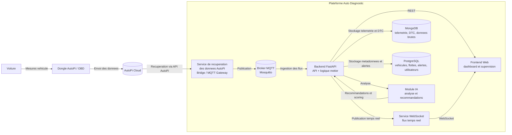

# Diagramme UML - Architecture globale

## Legende des flux
- Acquisition: la voiture envoie ses informations au dongle AutoPi.
- AutoPi Cloud: les donnees transitent d'abord par le cloud AutoPi.
- Integration plateforme: un service recupere les donnees AutoPi puis les injecte dans la plateforme.
- Backend: il traite, stocke et expose les donnees.
- WebSocket: il diffuse les mises a jour en temps reel vers l'interface web.
- IA: elle analyse les donnees pour produire alertes, scoring et recommandations.
- Frontend: il affiche les resultats pour la supervision et la gestion de flotte.
